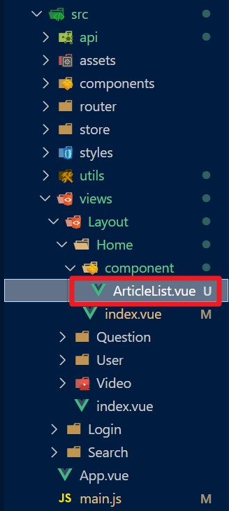
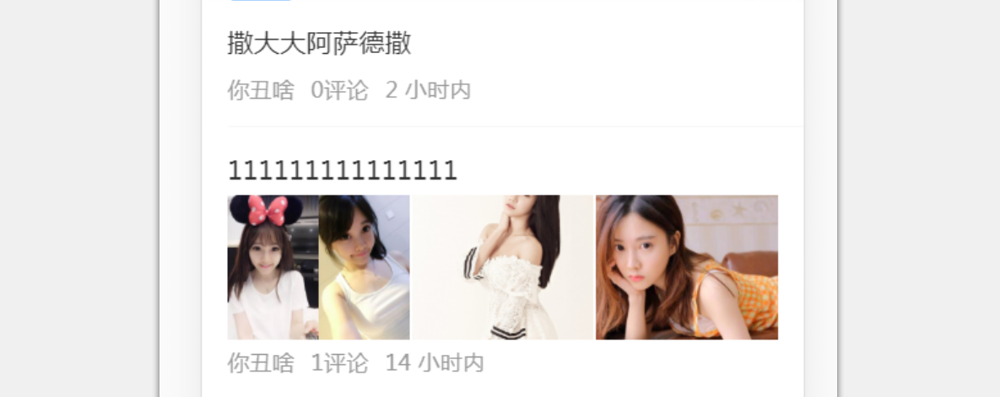
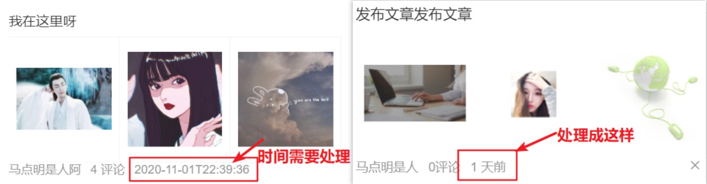

# day80

## 首页文章列表 article-list

> **article-list**抽离成组件形式方便处理逻辑
>
> 

### 组件使用

- `src/views/Layout/Home/index.vue`引入

  ```vue
  <script>
  import ArticleList from './component/ArticleList'
  </script>
  ```

- 注册

  ```vue
  <script>
  export default {
    components: {
      ArticleList
    },
  }
  </script>
  ```

- 使用

  ```vue
  <template>
    <div class="home-container">
      <van-tabs v-model="active">
        <van-tab v-for="item in channels" :key="item.id" :title="item.name">
          <article-list></article-list>
        </van-tab>
      </van-tabs>
    </div>
  </template>
  ```

  - van-tabs 只有点到了对应的 tab, 才会去加载对应tab的内容
  - 并且 van-tabs 会默认缓存已经加载过的结果 (利于性能优化)

### 父传子传入频道信息

- 属性传递

  ```vue
  <article-list :channel="item"></article-list>
  ```

- `src/views/Layout/Home/component/ArticleList.vue`组件接收

  ```vue
  props: {
      channel: {
        type: Object,
        required: true
      }
    }
  ```

### article-list基本效果

- `src/utils/vant-ui.js`引入[**van-list组件**](https://youzan.github.io/vant/#/zh-CN/list#ji-chu-yong-fa) 

- 布局

  ```vue
  <template>
    <div class="articleList">
      <van-pull-refresh v-model="refreshing" @refresh="onRefresh">
        <van-list
          v-model="loading"
          :finished="finished"
          finished-text="==私は底线もある=="
          @load="onLoad"
        >
          <van-cell
            v-for="item in list"
            :key="item.art_id"
            :title="item.title"
          >
          </van-cell>
        </van-list>
      </van-pull-refresh>
    </div>
  </template>
  ```

- 数据准备

  ```js
  data() {
    return {
      list: [],// 展示的章列表
      loading: false,// 是否正在加载数据
      finished: false,// 是否完成加载数据
      refreshing: false,// 是否正在下拉刷新
      timestamp: null// 时间戳
    }
  },
  methods: {
    async onLoad() {},
    async onRefresh() {}
  }
  ```

#### 新建接口API

- `src/api/article.js`

  ```js
  import http from '@/utils/http'
  /**
   * 获取某个频道下的文章列表
   * @param {*} channelId 频道id
   * @param {*} timestamp 时间戳
   */
  export const reqGetArticles = (channelId, timestamp) => {
    return http({
      method: 'get',
      url: '/v1_1/articles',
      params: {
        with_top: 1, // 包含置顶文章
        channel_id: channelId,
        timestamp
      }
    })
  }
  ```

  - 参数说明：
    - channelId：当前频道编号
    - timestamp：时间戳
      - 请求新的推荐数据传当前的时间戳，请求历史推荐传指定的时间戳
    - with_top：固定为**1**(包含置顶)

#### 组件调用接口

- `src/views/Layout/Home/component/ArticleList.vue`

  ```js
  import { reqGetArticles } from '@/api/article'
  ```

#### 方法逻辑

- `async onLoad() {}`上拉加载

  ```js
  async onLoad() {
    // 首次加载无时间戳，则new出新的时间戳
    if (!this.timestamp) {
      this.timestamp = +new Date()
    }
    // 调试信息
    console.log('当前数据的条数', this.list.length, '加载新数据')
    // 异步更新数据，解构赋值需要的数据  
    const {
      data: { data: articles }
    } = await reqGetArticles(this.channel.id, this.timestamp)
    // 将更新数据中的时间戳存入
    this.timestamp = articles.pre_timestamp
    // 展开运算符对文章列表赋值
    this.list = [...this.list, ...articles.results]
    // 加载时自动变更为true，需要手动更改
    this.loading = false
    // 新信息更新数量为0时展示更新完成信息
    if (articles.results === 0) {
      this.finished = true
    }
  },
  ```

- `async onRefresh() {}`下拉刷新

  ```js
  async onRefresh() {
    // 调试信息
    console.log('下拉刷新了')
    // 1. 取回最新的文章 (要传入最新的时间戳)
    const {
      data: { data: result }
    } = await reqGetArticles(this.channel.id, Date.now())
    // 保存时间戳, 以便加载下一页传入
    this.timestamp = result.pre_timestamp
    // 2. 将数据覆盖到 list中
    this.list = result.results
    // 3. 提示更新结果
    this.$toast.success('刷新成功')
    // 4. 结束loading状态
    this.refreshing = false
  }
  ```

### 接口大数处理

> 接口返回的 id , 是一个特别大的数,  js 中直接解析会丢失精度 (id不能丢失精度)
>
> js中`Math.pow(2, 53) + 1 === Math.pow(2, 53)` 是 true
>
> 因此需要处理大数

- 插件安装

  ```bash
  yarn add json-bigint
  ```

- `src/utils/http.js`针对**axios**做修改

  ```js
  import JSONbig from 'json-bigint'
  
  const http = axios.create({
    baseURL: 'http://toutiao-app.itheima.net',
    transformResponse: [
      data => {
        try {
          // 对于符合的字符串修改解析手段
          return JSONbig.parse(data)
        } catch (error) {
          // 对于不符合的字符串原样返回
          return data
        }
      }
    ]
  })
  ```

- 调整结构中**key**值

  ```vue
  <van-cell
    v-for="item in list"
    :key="item.art_id.toString()"
    :title="item.title"
  >
  </van-cell>
  ```

### 文章列表布局



- 涉及组件
  - [**van-cell**](https://youzan.github.io/vant/#/zh-CN/cell)：中的插槽[label](https://youzan.github.io/vant/#/zh-CN/cell#cell-slots) 
  - [**van-grid**](https://youzan.github.io/vant/#/zh-CN/grid)：宫格布局组件

  - [**van-image**](https://youzan.github.io/vant/#/zh-CN/image)：图片处理

- 调整组件结构

  ```vue
  <template>
    <div class="articleList">
      <van-pull-refresh v-model="refreshing" @refresh="onRefresh">
        <van-list
          v-model="loading"
          :finished="finished"
          finished-text="==私は底线もある=="
          @load="onLoad"
        >
          <van-cell
            v-for="item in list"
            :key="item.art_id.toString()"
            :title="item.title"
          >
            <template #label>
              <van-grid :column-num="item.cover.images.length">
                <van-grid-item
                  v-for="(img, index) in item.cover.images"
                  :key="index"
                >
                  <van-image lazy-load :src="img" />
                </van-grid-item>
              </van-grid>
              <!-- 文字说明 -->
              <div class="meta">
                <span>{{ item.aut_name }}</span>
                <span>{{ item.comm_count }}评论</span>
                <span>{{ item.pubdate | relative }}</span>
              </div>
            </template>
          </van-cell>
        </van-list>
      </van-pull-refresh>
    </div>
  </template>
  ```

- 调整样式

  ```vue
  <style lang="scss" scoped>
  .articleList {
    .meta {
      span {
        margin-right: 10px;
      }
    }
  }
  </style>
  ```

### 相对时间处理 - 插件 dayjs + 过滤器



- 安装插件

  ```bash
  yarn add dayjs
  ```

- 模块封装`src/utils/date-time.js`

  ```js
  import dayjs from 'dayjs'
  import relativeTime from 'dayjs/plugin/relativeTime'
  import 'dayjs/locale/zh-cn'
  
  dayjs.extend(relativeTime)
  dayjs.locale('zh-cn')
  
  export const formatTime = val => {
    return dayjs(val).format('DD/MM/YYYY')
  }
  
  export const getRelativeTime = yourTime => {
    return dayjs(yourTime).fromNow()
  }
  ```

- 定义成全局过滤器 `main.js`

  ```js
  import { getRelativeTime } from '@/utils/date-time'
  
  Vue.filter('relative', getRelativeTime)
  ```

- 使用过滤器`src/views/Layout/Home/component/ArticleList.vue`

  ```vue
  <!-- 文字说明 -->
  <div class="meta">
    <span>{{ item.aut_name }}</span>
    <span>{{ item.comm_count }}评论</span>
    <span>{{ item.pubdate | relative }}</span>
  </div>
  ```

### 图片懒加载

> 图片数据（就是url地址）取回来之后，不是**立刻设置**给image的src属性。
>
> 只要设置了src 属性，浏览器就会立即去请求src中的那张图。
>
> 只有当这张图片处于可见区域（或者是快了接近）时，才去设置src属性去求图片。

- 导入`main.js`

  ```js
  import { Lazyload } from 'vant'
  Vue.use(Lazyload)
  ```

- 使用`src/views/Layout/Home/component/ArticleList.vue`

  ```vue
  <van-image lazy-load :src="img" />
  ```

  