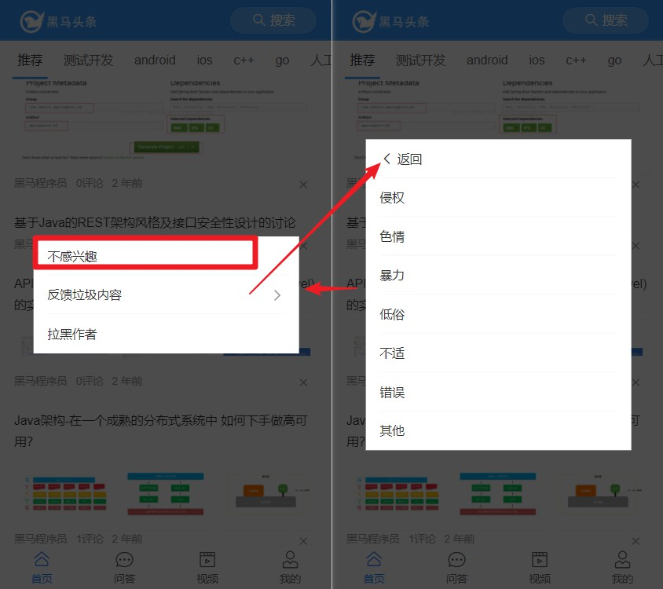

# day81

## 文章列表-不感兴趣



### 新建组件

- `src/views/Layout/Home/component/MoreAction.vue`

- 父组件中**注册**使用，与`ArticleList.vue`并s列

  ```vue
  <div class="home-container">
    <van-tabs v-model="active">
      ...
    </van-tabs>
    <van-popup v-model="showMore" :style="{ width: '80%' }">
      <more-action></more-action>
    </van-popup>
  </div>
  ```

- 提供弹出层的组件[**van-popup**](https://youzan.github.io/vant/#/zh-CN/popup)

- 准备数据

  ```js
  showMore: false,// true-显示,false-影藏
  ```

### MoreAction 静态结构

```vue
<template>
  <div class="more-action">
    <!-- 状态一 -->
    <van-cell-group v-if="!isReport">
      <van-cell>不感兴趣</van-cell>
      <van-cell is-link @click="isReport=true">反馈垃圾内容</van-cell>
      <van-cell>拉黑作者</van-cell>
    </van-cell-group>
    <!-- 状态二 反馈-->
    <van-cell-group v-else>
      <van-cell icon="arrow-left" @click="isReport=false">返回</van-cell>
      <van-cell>侵权</van-cell>
      <van-cell>色情</van-cell>
      <van-cell>暴力</van-cell>
      <van-cell>低俗</van-cell>
      <van-cell>不适</van-cell>
      <van-cell>错误</van-cell>
      <van-cell>其他</van-cell>
    </van-cell-group>
  </div>
</template>

<script>
export default {
  name: 'MoreAction',
  data () {
    return {
      isReport: false // 是否是处于状态二：反馈
    }
  }
}
</script>

<style lang='scss' scoped>
.more-action {
  border-radius: 4px;
}
</style>
```

#### MoreAction组件-显示控制

> 在文章列表中的每篇文章后，附一个**关闭**按钮,用户点击之后，弹出`MoreAction`组件

- 结构`ArticleList.vue`中

  ```vue
  <!-- 文字说明 -->
  <div class="meta">
    <span>{{ item.aut_name }}</span>
    <span>{{ item.comm_count }}评论</span>
    <span>{{ item.pubdate | relative }}</span>
    <!-- 只有登录的用户, 才能看见这个 x 按钮 -->
    <span
      @click="close(item.art_id.toString())"
      class="close"
      v-if="tokenInfo.token"
    >
      <van-icon name="cross"></van-icon>
    </span>
  </div>
  ```

- 样式调整

  ```vue
  <style lang="scss" scoped>
  .articleList {
    .meta {
      width: 100%;
      span {
        margin-right: 10px;
      }
      .close {
        float: right;
        margin-top: 4px;
      }
    }
  }
  </style>
  ```

- **登录**的用户**显示** 删除按钮,  不登录的用户则不显示

  > 通过判断 vuex 中的 token 是否存在决定

  ```jsx
  import { mapState } from 'vuex'
  
  computed: {
    ...mapState('user', ['tokenInfo'])
  },
  ```

#### 点击关闭 - 控制显示 MoreAction

- `MoreAction`中给`x`按钮注册`close`事件

  ```js
  // 传入文章的id
  close(id) {
    // 触发父组件事件调用弹出层
    this.$emit('show-more', id)
  }
  ```

- `views/Home/index.vue`

  ```jsx
  <article-list
    @closePopUp="showMore = false"
    @show-more="handleShowMore"
    :channel="item"
  >
  </article-list>
  
  methods: {
    handleShowMore() {
        this.showMore = true
    }
  },
  ```

### 点击不感兴趣的数据传递

- 准备接口API`src/api/article.js`

  ```js
  /**
   * 不喜欢文章(不感兴趣)
   * @param {*} articleId 文章 id
   */
  export const reqDisLikeArticle = (articleId) => {
    return http({
      method: 'post',
      url: '/v1_0/article/dislikes',
      data: {
        target: articleId
      }
    })
  }
  ```

- 根据API分析

  - 需要文章id（可以在`close`方法获得，存入`data`）

    ```js
    /* ArticleList.vue */
    data() {
      return {
      	disLikeId: null
      }
    },
    close(id) {
      this.$emit('show-more', id)
      this.disLikeId = id
    }
    ```

  - 点击`不感兴趣时触发`，通过vue时间总线发布事件

    > 事件总线`eventBus`
    >
    > - `main.js`中挂载
    >
    >   ```js
    >   /* Vue.prototype.$bus = new Vue() */
    >   const bus = new Vue()
    >   Vue.prototype.$bus = bus
    >   ```
    >
    > - `this.$bus.$emit()`[**发布事件**]
    >
    > - `this.$bus.$on()`[**订阅事件**]

    ```jsx
    /* MoreAction.vue */
    <van-cell @click="disLike">不感兴趣</van-cell>
    methods: {
      disLike() {
        this.$bus.$emit('delDisLike')
      }
    }
    ```

  - `ArticleList.vue`组件订阅处理逻辑

    ```js
    // 生命周期函数
    created() {
      // 订阅事件
      this.$bus.$on('delDisLike', async () => {
        // 调用接口，确保下次不再推送不感兴趣的文章
        await reqDisLikeArticle(this.disLikeId)
        // 显示窗口删除不感兴趣的文章
        this.list = this.list.filter(
          item => item.art_id.toString() !== this.disLikeId
        )
        // 通知父组件关闭弹出框
        this.$emit('closePopUp')
      })
    }
    ```

  - `views/Home/index.vue`

    ```jsx
    <article-list
      // showMore = false关闭弹出层
      @closePopUp="showMore = false"
      @show-more="handleShowMore"
      :channel="item"
    >
    </article-list>
    ```

    

