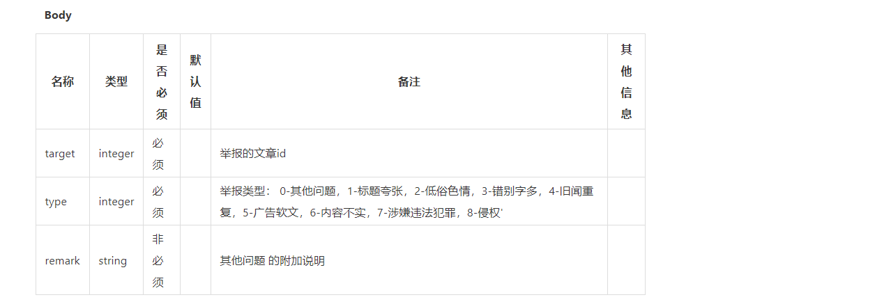
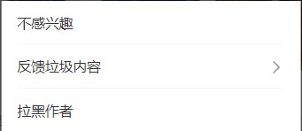
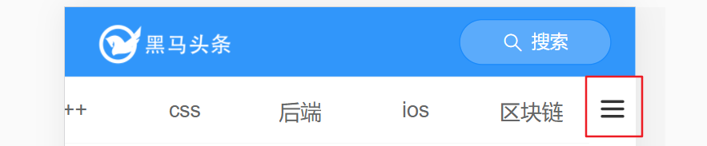
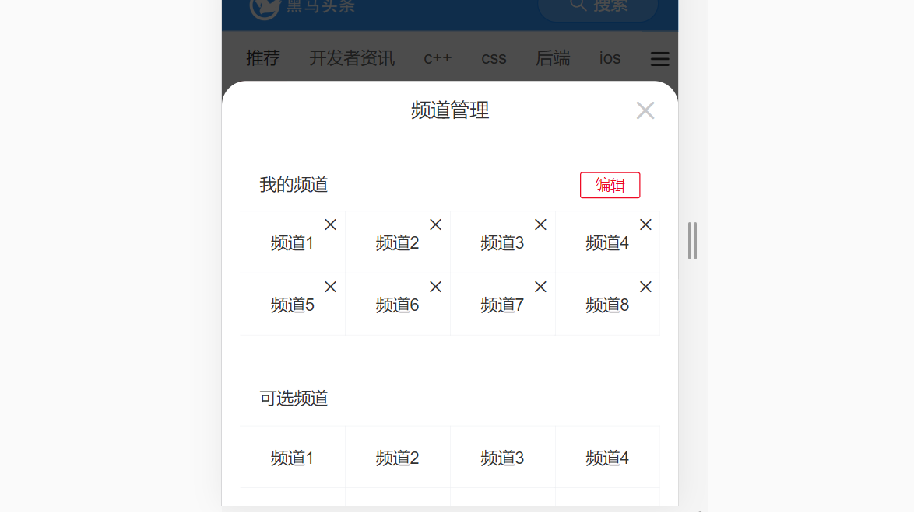
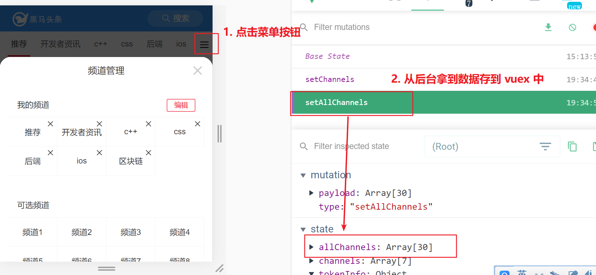
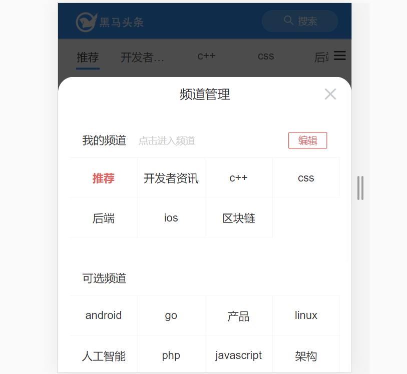

# day82

### 举报文章

- 抽离常量

  

  > 根据接口文档，为方便取用数据，固将常量数据抽离成**js**文件

  常量.jpg)

  ```js
  // 以模块的方式导出 举报文章 时，后端接口约定的举报类型
  const reports = [
    {
      value: 0,
      label: '其它问题'
    },
    {
      value: 1,
      label: '标题夸张'
    },
    {
      value: 2,
      label: '低俗色情'
    },
    {
      value: 3,
      label: '错别字多'
    },
    {
      value: 4,
      label: '旧闻重复'
    },
    {
      value: 6,
      label: '内容不实'
    },
    {
      value: 8,
      label: '侵权'
    },
    {
      value: 5,
      label: '广告软文'
    },
    {
      value: 7,
      label: '涉嫌违法犯罪'
    }
  ]
  
  export default reports
  ```

- 修改组件结构，渲染视图

  ```jsx
  <!-- 状态二 反馈-->
  <van-cell-group v-else>
    <van-cell icon="arrow-left" @click="isReport = false">返回</van-cell>
    <van-cell
      v-for="item in reportList"
      :key="item.value"
    >
      {{ item.label }}
    </van-cell>
  </van-cell-group>
  
  import reportList from '@/constant/report'
  
  data() {
    return {
      reportList
    }
  },
  ```

- 封装接口API`src/api/article.js` 

  ```js
  /**
   * 举报文章
   * @param {*} articleId 文章编号
   * @param {*} type 举报类型编号
   */
  export const reqReportArticle = (articleId, type) => {
    return http({
      method: 'post',
      url: '/v1_0/article/reports',
      data: {
        target: articleId,
        type
      }
    })
  }
  ```

- 逻辑处理

  - `MoreAction.vue`

    ```jsx
    <van-cell
      @click="report(item.value)"
      v-for="item in reportList"
      :key="item.value"
    >
    methods: {
      // 点击举报内容触发事件，将类型id传入
      report(typeId) {
        // 发布事件ArticleList.vue订阅处理
        this.$bus.$emit('report', typeId)
      }
    }
    ```

  - `ArticleList.vue`

    ```jsx
    created() {
      this.$bus.$on('report', async typeId => {
        // 修改参数disLikeId --> 就是文章id==>ArticleId
        await reqReportArticle(this.ArticleId, typeId)
        // 可以添加$toast，也可以使用视图删除的代码，删除举报内容
        /*
        this.list = this.list.filter(
          item => item.art_id.toString() !== this.ArticleId
        )
        this.$emit('closePopUp')
        */
        /* this.$toast.success('等待处理,感谢反馈') */
      })
    }
    ```

- 视图优化，每次点击更多操作`x`按钮时都出现<!-- 状态一 -->

  

  ```jsx
  /* src/views/Layout/Home/index.vue */
  <!-- 弹出层 -->
  <van-popup v-model="showMore" :style="{ width: '80%' }">
    <more-action ref="more"></more-action>
  </van-popup>
  
  methods: {
    handleShowMore() {
      this.showMore = true
      // 每次显示弹窗时恢复状态一，由于DOM更新为异步，所以使用 this.$nextTick()下次DOM更新后执行
      this.$nextTick(() => {
        this.$refs.more.isReport = false
      })
    }
  },
  ```

## 频道管理

### 基本图标布局



- `views/home/index.vue` 准备结构&样式

  ```jsx
  <!-- 频道列表开关 通过定位 -->
  <div class="bar-btn">
    <van-icon name="wap-nav" />
  </div>
  
  // 定位tab栏
  .van-tabs__wrap {
    position: fixed;
    left: 0;
    // 右侧流出空间，避免图标覆盖文字
    right: 30px;
    top: 46px;
  }
  
  // 频道管理的开关按钮
  .bar-btn {
    position: fixed;
    right: 5px;
    top: 57px;
    display: flex;
    align-items: center;
    background-color: #fff;
    opacity: 0.8;
    z-index: 1;
    .van-icon-wap-nav {
      font-size: 20px;
    }
  }
  ```

### [ActionSheet]( https://vant-contrib.gitee.io/vant/#/zh-CN/action-sheet)组件

- 注册组件

- 自定义内容

  ```jsx
  <van-action-sheet v-model="showChannelEdit" title="标题">
    <div class="content">内容</div>
    <div class="content">内容</div>
    <div class="content">内容</div>
    <div class="content">内容</div>
    <div class="content">内容</div>
  </van-action-sheet>
  
  data () {
    return {
      showChannelEdit: false
    }
  }
  ```

- 注册点击事件,  点击时显示面板

  ```jsx
  <!-- 频道列表开关 通过定位 -->
  <div class="bar-btn" @click="showChannelEditSheet">
    <van-icon name="wap-nav" />
  </div>
  ```

### 封装 channelEdit 组件

- `src/views/Layout/Home/component/ChannelEdit.vue`复制组件基础内容

  ```jsx
  <template>
    <div class="channel-edit">
      <!-- 当前登陆用户已经订阅的频道 -->
      <div class="channel">
        <van-cell title="我的频道" :border="false">
          <van-button plain size="mini" type="danger">编辑</van-button>
        </van-cell>
        <van-grid>
          <van-grid-item v-for="index in 8" :key="index">
            <span>频道{{index}}</span>
            <van-icon name="cross" class="btn"></van-icon>
          </van-grid-item>
        </van-grid>
      </div>
       <!-- 当前登陆用户没有订阅的频道 -->
      <div class="channel">
        <van-cell title="可选频道" :border="false"></van-cell>
        <van-grid>
          <van-grid-item v-for="index in 8" :key="index">
            <span>频道{{index}}</span>
          </van-grid-item>
        </van-grid>
      </div>
    </div>
  </template>
  
  <script>
  export default {
    name: 'ChannelEdit',
    data () {
      return {
  
      }
    }
  }
  </script>
  
  <style lang="scss" scoped>
  .channel{
    padding:15px;
    font-size:14px;
    ::v-deep .van-button--mini {
      height: 22px;
      min-width: 50px;
    }
    .btn {
      position: absolute;
      top: 5px;
      right: 5px;
      font-size: 14px;
    }
  }
  </style>
  ```

- 组件导入

  ```jsx
  import ChannelEdit from './component/ChannelEdit'
  
  components: {
    ChannelEdit
  }
  ```

- 修改布局

  ```jsx
  <!-- 折叠面板 -->
  <van-action-sheet v-model="showChannelEdit" title="标题">
    <channel-edit></channel-edit>
  </van-action-sheet>
  ```

  

### 使用vuex管理频道分类数据

- 封装接口API

  ```js
  /**
   * 获取所有的频道信息
   */
  export const reqGetAllChannels = () => {
    return http({
      method: 'get',
      url: '/v1_0/channels'
    })
  }
  ```

- 模块`src/store/modules/channels.js`

  ```js
  // 准备state数据
  const state = {
    ...
    // 所有的频道数据
    allChannels: []
  }
  const mutations = {
    ...
    setAllChannels (state, allChannels) {
      state.allChannels = allChannels
    }
  }
  const actions = {
    ...
    async getAllChannelsAsync (context) {
      const res = await reqGetAllChannels()
      context.commit('setAllChannels', res.data.data.channels)
    }
  }
  ```

- 在 `channelEdit.vue` 页面中调用 action, 获取数据, 存到 vuex 中

  ```jsx
  import { mapActions, mapState } from 'vuex'
  
  methods: {
    ...mapActions('channels', ['getAllChannelsAsync'])
  },
  created () {
    this.getAllChannelsAsync()
  }
  ```

  

- 定义 **getters** 基于 **allChannels** 和 **channels** 计算得到可选频道  **optionalChannels**

  ```js
  const getters = {
    // 可选的频道
    optionalChannels(state) {
      // 对 allChannels 中的元素进行过滤, 只保留那些没有在 channels 中出现的元素
      return state.allChannels.filter(channel => {
        const index = state.channels.findIndex(item => item.id === channel.id)
        // 如果找到了, index不是 -1, 如果找不到才是 -1 (要留下)
        return index === -1
      })
    }
  }
  ```

- 通过mapGetters 映射, 渲染到页面中

  ```jsx
  <div class="channel">
    <van-cell title="可选频道" :border="false"></van-cell>
    <van-grid>
      <van-grid-item v-for="item in optionalChannels" :key="item.id">
        <span>{{ item.name }}</span>
      </van-grid-item>
    </van-grid>
  </div>
  
  computed: {
    ...mapGetters('channels', ['optionalChannels'])
  }
  ```

### 点击进入频道(子传父)

- 注册点击事件

  ```jsx
  <van-grid>
    <van-grid-item @click="clickMychannel(item)" v-for="item in channels" :key="item.id">
      <span>{{ item.name }}</span>
      <!-- <van-icon name="cross" class="btn"></van-icon> -->
    </van-grid-item>
  </van-grid>
  ```

- 点击时触发事件, 并传值

  ```jsx
  clickMychannel (item) {
    this.$emit('update-curchannel', item)
  }
  ```

- 父组件注册事件, 接收参数, 完成功能

  ```jsx
  <!-- 折叠面板 -->
  <van-action-sheet v-model="showChannelEdit" title="频道管理">
    <channel-edit @update-curchannel="updateCurChannel"></channel-edit>
  </van-action-sheet>
  
  
  updateCurChannel (channel) {
    // 1. 关闭弹层
    this.showChannelEdit = false
    // 2. 切换到当前点击的频道上去 (更新下标active)
    const index = this.channels.findIndex(item => item.id === channel.id)
    if (index !== -1) {
      this.active = index
    }
  }
  ```

### 高亮当前频道 (父传子)

- 添加属性父传子

  ```jsx
  <!-- 折叠面板 -->
  <van-action-sheet v-model="showChannelEdit" title="频道管理">
    <channel-edit :active="active" @update-curchannel="updateCurChannel"></channel-edit>
  </van-action-sheet>
  ```

- 在子组件 `channel-edit.vue` 中接收

  ```jsx
  props: {
    active: {
      type: Number, // 必须是Number类型
      required: false, // 是否是必填项
      default: 0 // 默认值
    }
  },
  ```

- 根据 active, 可以给元素添加样式 current

  ```jsx
  <van-grid>
    <van-grid-item :class="{ current: index === active }" @click="clickMychannel(item)" v-for="(item, index) in channels" :key="item.id">
      <span>{{ item.name }}</span>
      <!-- <van-icon name="cross" class="btn"></van-icon> -->
    </van-grid-item>
  </van-grid>
  
  .current {
    color: #e5615b;
    font-weight: bold;
  }
  ```

  

