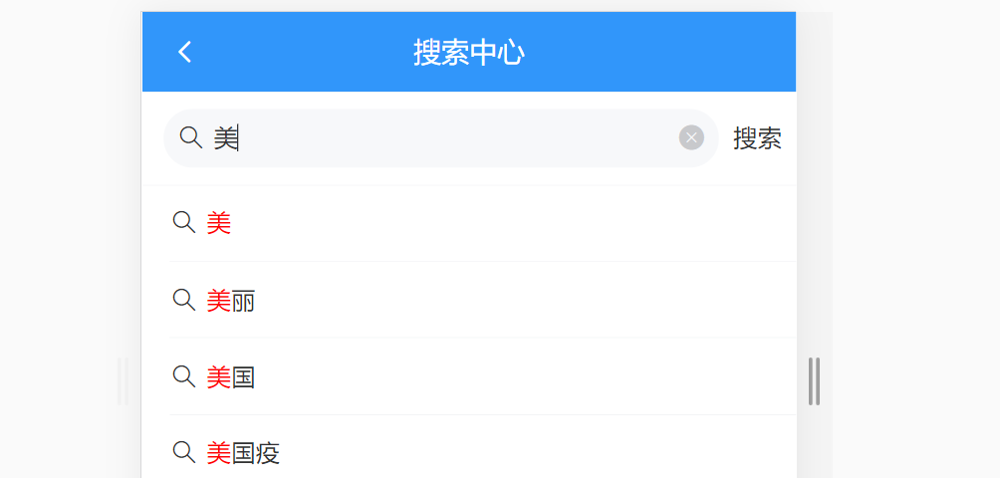
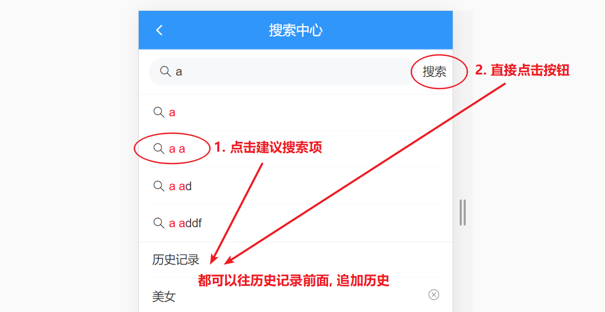

# day83

### 添加频道

- 封装API`src/api/channels.js`

  ```js
  /**
   * 设置用户频道(重置式)
   * @param {*} channels
   * - id 频道id
   * - seq 顺序序号
   */
  export const reqSetChannels = channels => {
    return http({
      method: 'put',
      url: '/v1_0/user/channels',
      data: {
        channels
      }
    })
  }
  ```

- 注册点击事件

  ```vue
  <div class="channel">
    <van-cell title="可选频道" :border="false"></van-cell>
    <van-grid>
      <van-grid-item @click="clickAddChannel(item)" v-for="item in optionalChannels" :key="item.id">
        <span>{{ item.name }}</span>
      </van-grid-item>
    </van-grid>
  </div>
  ```

- 点击时添加数据 (不能直接操作 vuex中的 channels) 需要提供 mutations

  ```js
  /* src/store/modules/channels.js */
  const mutations = {
    addChannel (state, channel) {
      state.channels.push(channel)
    }
  }
  ```

- 同步到后台

  ```jsx
  import { reqSetChannels } from '@/api/channels.js'
  
  methods: {
    ...mapMutations('channels', ['addChannel']),
    clickAddChannel(channel) {
      // 1. 将选择 channel 数据往我的频道 channel 中添加 (不要操作vuex中的数据, 要提交mutation)
      this.addChannel(channel)
      // 2. 组装接口需要的数据
      const channelList = this.channels.map((item, index) => {
        return {
          id: item.id,
          seq: index
        }
      })
      // 去掉推荐频道, 由于推荐频道是在第一个位置，所以这里直接删除第一个
      channelList.unshift()
  
      // 3. 发送重置式请求
      await reqSetChannels(channelList)
    }
  }
  ```

### 删除频道

#### 控制删除按钮的显示隐藏

- 提供一个数据项

  ```js
  data () {
    return {
      editing: false // 是否处于编辑状态
    }
  },
  ```

- 点击时, 切换状态, 控制文字的显示

  ```jsx
  <van-button @click="editing=!editing" plain size="mini" type="danger">
    {{ editing ? '取消' : '编辑' }}
  </van-button>
  ```

- 控制删除按钮的显示隐藏 (如果是推荐, 不需要显示删除按钮)

  ```jsx
  <van-icon v-show="editing && index!==0" name="cross" class="btn"></van-icon>
  ```

#### 完成删除功能 - vuex中删除

- 注册点击事件

  ```jsx
  <van-icon @click="clickDelChannel(item)" v-show="editing && index!==0" name="cross" class="btn"></van-icon>
  ```

- 提供删除 channel 的 vuex mutation`src/store/modules/channels.js`

  ```js
  const mutations = {
    delChannel (state, channel) {
      state.channels = state.channels.filter(item => item.id !== channel.id)
    }
  }
  ```

- 提交mutation, 进行删除操作

  ```jsx
  methods: {
    ...mapMutations('channels', ['addChannel', 'delChannel']),
    clickDelChannel (channel) {
      // 将选择的 channel 从我的频道中删除 (提交mutation)
      this.delChannel(channel)
      // 组装接口需要的数据
      // 发送重置式请求
    }
  }
  ```

#### 封装方法, 发送重置式请求

```jsx
clickAddChannel (channel) {
  // 将选择 channel 数据往我的频道 channel 中添加 (不要操作vuex中的数据, 要提交mutation)
  this.addChannel(channel)
  this.resetChannel()
},

clickDelChannel (channel) {
  // 将选择的 channel 从我的频道中删除 (提交mutation)
  this.delChannel(channel)
  this.resetChannel()
},
  
async resetChannel () {
  // 组装接口需要的数据
  const channelList = this.channels.map((item, index) => {
    return {
      id: item.id,
      seq: index
    }
  })
  // 去掉推荐频道, 由于推荐频道是在第一个位置，所以这里直接删除第一个
  channelList.shift()
  // 发送重置式请求
  await reqSetChannels(channelList)
}
```

### 删除当前频道 - bug修复

> 如果删除的是当前频道, 那么 active 的那一项被删了, 下标应该恢复到推荐那里去, 而不是错乱掉
>
> 所以如果是当前频道被删除, 应该子传父, 通知到父组件, 更新 active 成 0
>
> 如果 index 小于 this.active, 说明删除的是前面的, 会错乱, 更新 active 成 this.active - 1

- 点击删除时, 可以拿到下标

  ```jsx
  <van-icon @click="clickDelChannel(item, index)" v-show="editing && index!==0" name="cross" class="btn"></van-icon>
  ```

- 让下标 和 active比较, 相同, 需要通知到父组件, 当前激活的项被删除了, 需要更新 active 成 0

     如果 index 小于 this.active, 说明删除的是前面的, 需要让 active - 1

  ```js
  clickDelChannel (channel, index) {
    if (index === this.active) {
      this.$emit('update-active', 0)
    }
    // 删除的是前面的项, 需要将 this.active - 1
    if (index < this.active) {
      this.$emit('update-active', this.active - 1)
    }
    // 将选择的 channel 从我的频道中删除 (提交mutation)
    this.delChannel(channel)
    this.resetChannel()
  }
  ```

- 父组件接收参数, 进行设置`src/views/Layout/Home/index.vue`

  ```jsx
  <!-- 折叠面板 -->
  <van-action-sheet v-model="showChannelEdit" title="频道管理">
    <channel-edit
      :active="active"
      @update-active="updateActive"
      @update-curchannel="updateCurChannel">
    </channel-edit>
  </van-action-sheet>
  
  
  updateActive (active) {
    this.active = active
  }
  ```

#### 提交合并分支

##文章搜索

> 新建分支search
>
> 涉及vant组件[**search组件**]( https://youzan.github.io/vant/#/zh-CN/search#zi-ding-yi-an-niu )

- 组件`src/views/Search/index.vue`(之前建立过)

- 导入组件

- 结构布置

  ```vue
  <template>
    <div class="search">
      <!-- 搜索组件一级路由   $router.back()返回上一个页面-->
      <van-nav-bar
        left-arrow
        title="搜索中心"
        @click-left="$router.back()">
      </van-nav-bar>
  
      <!-- https://youzan.github.io/vant/#/zh-CN/search -->
      <van-search
        show-action
        placeholder="请输入搜索关键词"
        shape="round"
        v-model.trim="keyword"
      >
        <template #action>
          <div>搜索</div>
        </template>
      </van-search>
  
      <!-- 联想建议 -->
      <van-cell-group>
        <van-cell title="js" icon="search" />
        <van-cell title="jsa" icon="search" />
      </van-cell-group>
      <!-- /联想建议 -->
  
      <!-- 搜索历史记录 -->
      <van-cell-group>
        <van-cell title="历史记录">
        </van-cell>
        <van-cell title="单元格">
          <van-icon name="close" />
        </van-cell>
        <van-cell title="单元格">
          <van-icon name="close" />
        </van-cell>
      </van-cell-group>
      <!-- /搜索历史记录 -->
    </div>
  </template>
  
  <script>
  export default {
    name: 'Search',
    data () {
      return {
        keyword: '' // 搜索关键字
      }
    }
  }
  </script>
  
  <style lang="" scoped>
  
  </style>
  ```

- 在 `styles/index.scss` 设置通用样式

  ```scss
  // 控制头部导航栏的通用样式
  .van-nav-bar {
    background-color: #3196fa;
    .van-nav-bar__title {
      color: white;
    }
    .van-icon {
      color: white;
    }
  }
  ```

### 搜索联想记忆



- 封装接口API

  ```js
  // 搜索相关的模块操作, 全都封装在这里
  import http from '@/utils/request'
  
  /**
   * 根据搜索关键字获取搜索建议
   * @param {*} keyword 关键字
   */
  export const reqGetSuggestion = keyword => {
    return http({
      method: 'get',
      url: '/v1_0/suggestion',
      params: {
        q: keyword
      }
    })
  }
  ```

- 给 van-search 注册 input 事件

  ```jsx
  <van-search
    show-action
    placeholder="请输入搜索关键词"
    shape="round"
    v-model.trim="keyword"
    @input="getSuggestion"
  >
    <template #action>
      <div>搜索</div>
    </template>
  </van-search>
  ```

- 引入 api , 发送请求

  ```jsx
  import { reqGetSuggestion } from '@/api/search.js'
  
  data () {
    return {
      keyword: '', // 搜索关键字
      suggestion: []
    }
  },
  methods: {
    async getSuggestion () {
      // 检查当前关键字是否为空
      if (this.keyword === '') {
        this.suggestion = []
        return
      }
      // 调用方法, 发送请求
      const {
        data: {
          data: { options }
        }
      } = await reqGetSuggestion(this.keyword)
      this.suggestion = options
    }
  }
  ```

- 显示建议结果

  ```jsx
  <!-- 联想建议 -->
  <van-cell-group>
    <van-cell
      v-for="item in handlerSuggestionList"
      :key="item"
      :title="item"
      icon="search"
    >
    </van-cell>
  </van-cell-group>
  <!-- /联想建议 -->
  ```

### 高亮搜索关键字

- 计算属性

  ```js
  computed: {
    handlerSuggestionList() {
      // 正则匹配搜索关键词，g-全局，i-忽略大小写
      const reg = new RegExp(this.keyword, 'gi')
      // 对所有联想搜索循环匹配
      return this.suggestion.map(item => {
        // 将模版字符替换正则匹配
        return item.replace(reg, match => {
          // 模版字符包裹的即为高亮的字符
          return `<span style="color: red;">${match}</span>`
        })
      })
    }
  }
  ```

- 结构用 v-html 显示数据

  ```jsx
  <!-- 联想建议 -->
  <van-cell-group>
    <van-cell
      v-for="item in handlerSuggestionList"
      :key="item"
      :title="item"
      icon="search"
    >
      <div v-html="item"></div>
    </van-cell>
  </van-cell-group>
  <!-- /联想建议 -->
  ```

### 搜索历史管理

> 此次采用本地存储方式存放历史记录
>
> 也可以通过API接口存储到服务器

- 搜索联想和历史记录互斥采用`v-if`，出现关键词则隐藏历史记录

  ```jsx
  <!-- 联想建议 -->
  <van-cell-group v-if="keyword">
    <van-cell
      v-for="(item, index) in handlerSuggestionList"
      :key="item"
      @click="clickSuggestion(index)"
      icon="search"
    >
      <div v-html="item"></div>
    </van-cell>
  </van-cell-group>
  <!-- /联想建议 -->
  <!-- 搜索历史记录 -->
  <van-cell-group v-else>
    ...
  </van-cell-group>
  <!-- /搜索历史记录 -->
  ```

- 准备数据项

  ```jsx
  data() {
    return {
      keyword: '', // 搜索关键字
      suggestion: [],
      history: []
    }
  },
  ```

- 结构调整

  ```jsx
  <!-- 搜索历史记录 -->
  <van-cell-group v-else>
    <van-cell title="历史记录"> </van-cell>
    <van-cell v-for="item in history" :key="item" :title="item">
      <van-icon name="close" />
    </van-cell>
  </van-cell-group>
  <!-- /搜索历史记录 -->
  ```

- 业务逻辑

  > 点击搜索、和建议项目都会产生历史
  >
  > 

- 注册事件

  ```jsx
  <van-search
    show-action
    placeholder="请输入搜索关键词"
    shape="round"
    v-model.trim="keyword"
    @input="getSuggestion"
  >
    <template #action>
      <div @click="clickSearchBtn">搜索</div>
    </template>
  </van-search>
  
  <!-- 联想建议 -->
  <van-cell-group v-if="keyword">
    <van-cell
      v-for="(item, index) in handlerSuggestionList"
      :key="item"
      @click="clickSuggestion(index)"
      icon="search"
    >
      <div v-html="item"></div>
    </van-cell>
  </van-cell-group>
  <!-- /联想建议 -->
  ```

- 保存历史到本地（封装方法）
  - `src/utils/storage.js`

    ```js
    ...
    
    // history 相关
    const history = 'history'
    
    export const setHistory = tokenObj => {
      localStorage.setItem(history, JSON.stringify(tokenObj))
    }
    
    export const getHistory = () => {
      return JSON.parse(localStorage.getItem(history)) || []
    }
    
    export const delHistory = () => {
      localStorage.removeItem(history)
    }
    ```

- `methods`方法

  ```js
  // 点击搜索按钮
  clickSearchBtn() {
    this.addHistory(this.keyword)
  },
  // 点击联想推荐
  clickSuggestion(index) {
    this.addHistory(this.suggestion[index])
  },
  // 添加历史(需要数组去重)
  addHistory(str) {
    const i = this.history.findIndex(item => item === str)
    if (i !== -1) {
      this.history.splice(i, 1)
    }
    this.history.unshift(str)
    setHistory(this.history)
  }
  ```

### 删除历史

- 给 `x` 注册点击事件

  ```jsx
  <!-- 搜索历史记录 -->
  <van-cell-group>
    <van-cell title="历史记录">
    </van-cell>
    <van-cell v-for="(item, index) in history" :key="item" :title="item">
      <van-icon @click="delHistory(index)" name="close"/>
    </van-cell>
  </van-cell-group>
  <!-- /搜索历史记录 -->
  ```

- 添加方法, 进行删除操作

  ```js
  delHistory(index) {
    this.history.splice(index, 1)
    setHistory(this.history)
  }
  ```

  