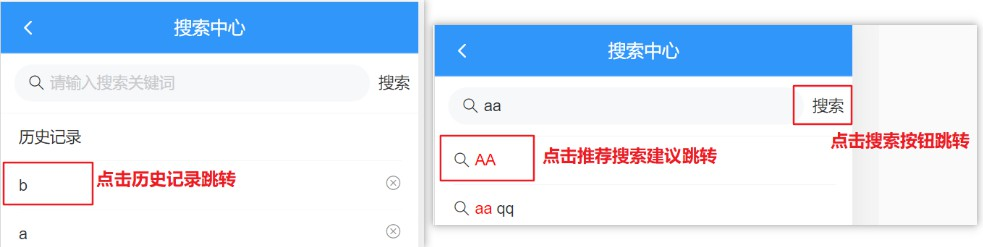
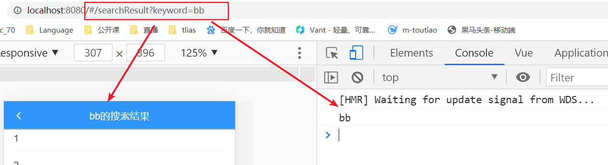
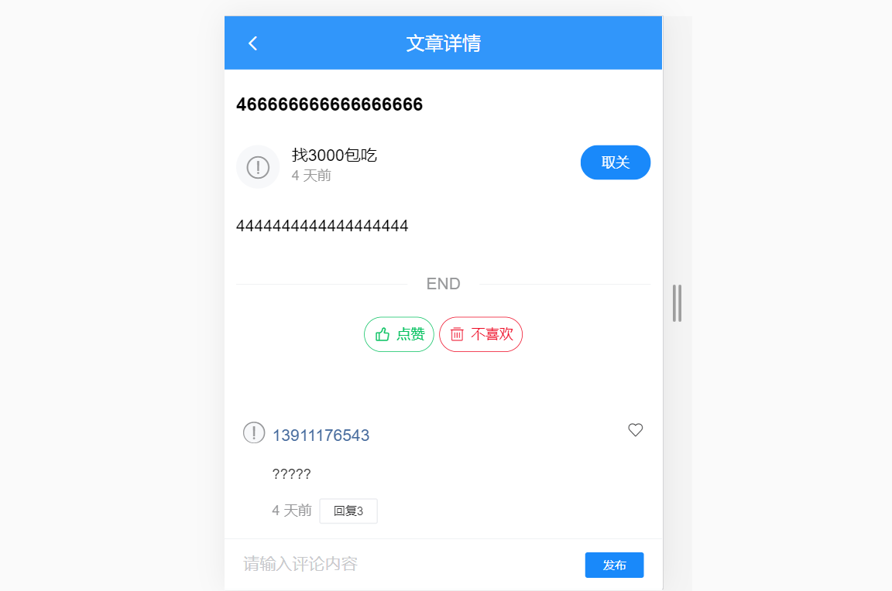
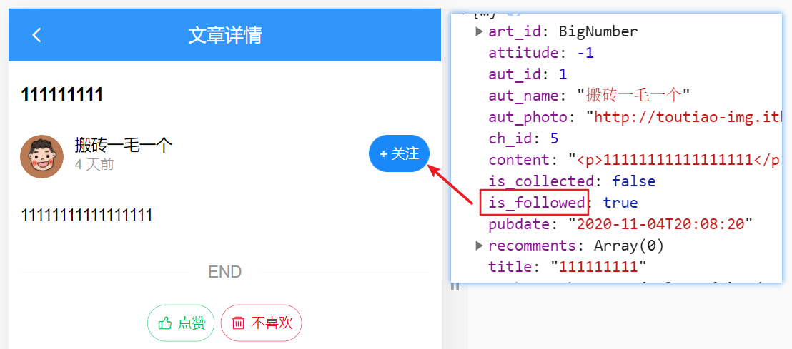
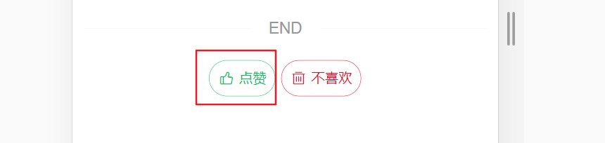
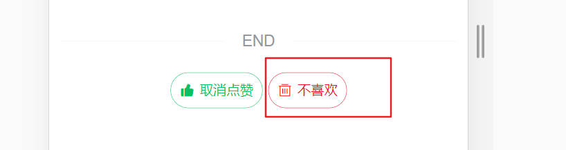
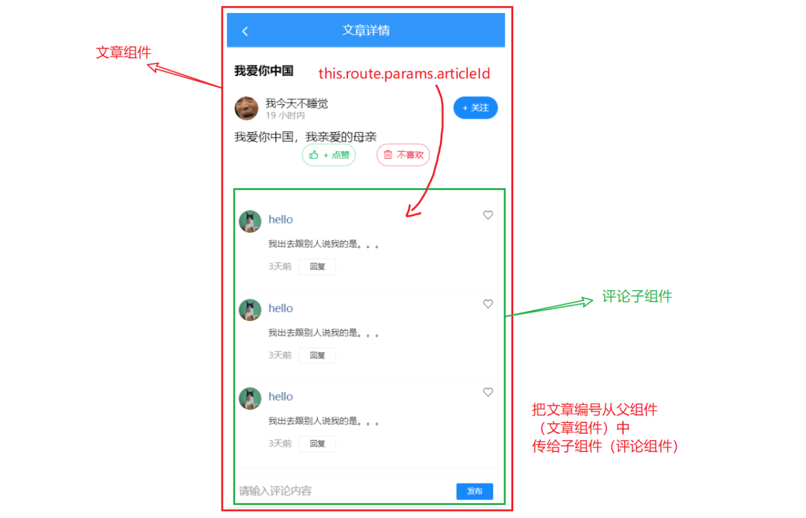

# day84

### 优化处理-防抖

> 关键词更改立即发送ajax请求

- 防抖（debounce）：事件触发的一段时间内没有再触发事件，则处理函数运行一次

  > 特点：不会立刻触发事件，而是在一定时间内没有再次触发，则执行事件

- `src/views/Search/index.vue`

  ```jsx
  data() {
    return {
      timerId: null // 保存定时器返回值
    }
  },
  
  getSuggestion() {
    // 触发事件-清空上一个定时器
    clearTimeout(this.timerId)
    // 定时器防抖
    this.timerId = setTimeout(async () => {
      // 检查当前关键字是否为空
      if (this.keyword === '') {
        this.suggestion = []
        return
      }
      // 调用方法, 发送请求
      const {
        data: {
          data: { options }
        }
      } = await reqGetSuggestion(this.keyword)
      this.suggestion = options
    }, 200) // 100-300ms 左右 不会太长
  },
  ```

- 与**节流**的对比
  - **防抖的典型特征**就是**延迟执行**, 一段时间内没有再触发事件, 才执行(常见应用场景: 实时搜索)
  - **节流的典型特征**就是**立刻执行**, 但是在执行中, 这件事没做完之前, 都不会再做这件事 (常见应用场景: 上拉加载, 下拉刷新)

## 搜索结果页面

- 新建组件`Search/components/SearchResult.vue`

- 配置路由信息（一级路由）

  ```js
  import SearchResult from '@/views/Search/components/SearchResult'
  
  { path: '/result', component: SearchResult },
  ```

- 结构样式（初步）

  ```jsx
  <template>
    <div class="search-result">
      <!-- 导航栏 -->
      <van-nav-bar
        title="xxx 的搜索结果"
        left-arrow
        fixed
        @click-left="$router.back()"
      />
      <!-- /导航栏 -->
  
      <!-- 文章列表 -->
      <van-list
        class="article-list"
        v-model="loading"
        :finished="finished"
        finished-text="没有更多了"
        @load="onLoad"
      >
        <van-cell
          v-for="item in list"
          :key="item"
          :title="item"
        />
      </van-list>
      <!-- /文章列表 -->
    </div>
  </template>
  
  <script>
  export default {
    name: 'SearchResult',
    data () {
      return {
        list: [],
        loading: false,
        finished: false
      }
    },
  
    methods: {
      onLoad () {
        // 异步更新数据
        setTimeout(() => {
          for (let i = 0; i < 10; i++) {
            this.list.push(this.list.length + 1)
          }
          // 加载状态结束
          this.loading = false
  
          // 数据全部加载完成
          if (this.list.length >= 40) {
            this.finished = true
          }
        }, 500)
      }
    }
  }
  </script>
  
  <style lang="scss" scoped>
  .search-result {
    .article-list {
      margin-top: 39px;
    }
  }
  </style>
  ```

### 搜索路由跳转 -- 传参`src/views/Search/index.vue`



- 搜索跳转

  ```jsx
  <template #action>
    <div @click="clickSearchBtn">搜索</div>
  </template>
  
  methods: {
    clickSearchBtn() {
      if (this.keyword === '') return
      this.addHistory(this.keyword)
      this.$router.push('/result?keywords=' + this.keyword)
    }
  }
  ```

- 历史跳转

  ```jsx
  <!-- 搜索历史记录 -->
  <van-cell-group>
    <van-cell title="历史记录"> </van-cell>
    <van-cell
      v-for="(item, index) in history"
      :key="item"
      :title="item"
      @click="$router.push('/result?keywords=' + item)"
    >
      <!-- 添加事件描述符，避免点击删除图标跳转 -->  
      <van-icon @click.stop="delHistory(index)" name="close" />
    </van-cell>
  </van-cell-group>
  <!-- /搜索历史记录 -->
  ```

- 联想记忆跳转

  ```jsx
  clickSuggestion(index) {
    this.addHistory(this.suggestion[index])
    this.$router.push('/result?keywords=' + this.suggestion[index])
  },
  ```

### 在结果页获取参数请求

- `$route.query.keywords`获取参数

  ```jsx
  <!-- 导航栏 -->
  <van-nav-bar
    :title="$route.query.keywords + '的搜索结果'"
    left-arrow
    fixed
    @click-left="$router.back()"
  />
  <!-- /导航栏 -->
  ```

  - 验证（方法）

    ```js
    created () {
      console.log(this.$route.query.keyword)
    },
    ```

    

- 封装接口, 在 `api/search.js` 封装请求方法

  ```js
  /**
   * 搜索
   * @param {*} q 搜索关键字
   * @param {*} page 搜索页码
   */
  export const reqGetSearch = (q, page) => {
    return http({
      method: 'get',
      url: '/v1_0/search',
      params: {
        q,
        page
      }
    })
  }
  ```

- 调用接口、处理数据

  ```jsx
  <script>
  import { reqGetSearch } from '@/api/search'
  export default {
    name: 'SearchResult',
    data() {
      return {
        list: [],
        loading: false,
        finished: false,
        page: 1
      }
    },
    created() {
      console.log(this.$route.query.keyword)
    },
    methods: {
      async onLoad() {
        // 1. 根据关键字调用 api 获取数据
        const keyword = this.$route.query.keywords
        const {
          data: {
            data: { results }
          }
        } = await reqGetSearch(keyword, this.page)
  
        // 2. 将结果, 追加到 list 后面
        const arr = results
        this.list = [...this.list, ...arr]
        this.page++ // 页码自增
  
        // 3. 将loading改成false
        this.loading = false
  
        // 4. 判断是否已经全部加载了数据
        if (arr.length === 0) {
          this.finished = true
        }
      }
    }
  }
  </script>
  ```

- 数据渲染

  ```jsx
  <!-- 文章列表 -->
  <van-list
    class="article-list"
    v-model="loading"
    :finished="finished"
    finished-text="没有更多了"
    @load="onLoad"
  >
    <van-cell
      v-for="item in list"
      :key="item.art_id.toString()"
      :title="item.title"
    />
  </van-list>
  <!-- /文章列表 -->
  ```

## 文章详情页



- 路由配置`views/article/index.vue`（一级路由）

  ```js
  import ArticleIndex from '@/views/Search/components/Article'
  // /:id -- 表示一个变量占位  props: true -- 开启参数接收，组件props变量名同id 
  { path: '/article/:id', component: ArticleIndex, props: true },
  ```

- 路由跳转

  - 首页文章列表, 点击文章可以跳转

    ```jsx
    /* src/views/Layout/Home/component/ArticleList.vue */
    <van-cell
      v-for="item in list"
      :key="item.art_id.toString()"
      :title="item.title"
      @click="$router.push('/article/' + item.art_id.toString())"
    >
    ```

  - 搜索结果页, 点击文章标题可以跳转

    ```jsx
    /* src/views/Search/components/SearchResult.vue */
    <van-cell
      v-for="item in list"
      :key="item.art_id.toString()"
      :title="item.title"
      @click="$router.push('/article/' + item.art_id.toString())"
    />
    ```

- 相关Vant组件导入

  ```js
  import {
    ...,
    Loading,
    Divider
  } from 'vant'
  
  Vue.use(Divider)
  Vue.use(Loading)
  ```

- 新建组件`Search/components/Article.vue`（初步结构样式）

  ```jsx
  <template>
    <div class="article-container">
      <!-- 导航栏 -->
      <van-nav-bar
        fixed
        left-arrow
        @click-left="$router.back()"
        title="文章详情"
      ></van-nav-bar>
      <!-- /导航栏 -->
  
      <!-- 加载中 loading -->
      <van-loading class="article-loading" />
      <!-- /加载中 loading -->
  
      <!-- 文章详情 -->
      <div class="detail">
        <h3 class="title">标题</h3>
        <div class="author">
          <van-image round width="1rem" height="1rem" fit="fill" />
          <div class="text">
            <p class="name">作者</p>
            <p class="time">4天前</p>
          </div>
          <van-button
            round
            size="small"
            type="info"
          >+ 关注</van-button>
        </div>
        <div class="content">
          <div>正文</div>
        </div>
        <van-divider>END</van-divider>
        <div class="zan">
          <van-button round size="small" hairline type="primary" plain icon="good-job-o">点赞</van-button>
          &nbsp;&nbsp;&nbsp;&nbsp;
          <van-button round size="small" hairline type="danger" plain icon="delete">不喜欢</van-button>
        </div>
      </div>
      <!-- /文章详情 -->
  
    </div>
  </template>
  
  <script>
  // push时传对象, params (写name传递) 就通过 this.$route.params获取
  // push时传对象, query  (写path)     就通过 this.$route.query 获取
  // 动态路由传参  /article/:id        this.$route.params 获取 
    
    
  export default {
    name: 'ArticleIndex',
    data () {
      return {
        loading: true, // 控制加载中的 loading 状态
        article: { }
      }
    }
  }
  </script>
  
  <style lang='scss' scoped>
  .article-container{
    position: absolute;
    left: 0;
    top: 0;
    overflow-y: scroll;
    width: 100%;
    height: 100%;
  }
  .article-loading {
    padding-top: 100px;
    text-align: center;
  }
  .error{
    padding-top: 100px;
    text-align: center;
  }
  .detail {
    padding: 50px 10px;
    .title {
      font-size: 16px;
    }
    .zan{
      text-align: center;
    }
    .author {
      padding: 10px 0;
      display: flex;
      .text {
        flex: 1;
        padding-left: 10px;
        line-height: 1.3;
        .name {
          font-size: 14px;
          margin: 0;
        }
        .time {
          margin: 0;
          font-size: 12px;
          color: #999;
        }
      }
    }
    .content {
      font-size:14px;
      overflow: hidden;
      white-space: pre-wrap;
      word-break: break-all;
      ::v-deep img{
        max-width:100%;
        background: #f9f9f9;
      }
    }
  }
  </style>
  ```

### 获取数据并显示

- `api/article.js`内新增接口

  ```js
  /**
   * 根据文章编号来获取文章详情
   * @param {*} id 文章编号
   */
  export const reqGetArticleDetail = id => {
    return http({
      method: 'GET',
      url: '/v1_0/articles/' + id
    })
  }
  ```

- 发送请求, 获取数据, 控制loading的状态

  ```jsx
  <van-loading v-if="loading" class="article-loading" />
  
  <div class="detail" v-else>
    ...
  </div>
  
  created() {
    console.log('this.id', this.id)
    this.loadArticle()
  },
  methods: {
    async loadArticle () {
      const res = await reqGetArticleDetail(this.$route.params.id)
      // 保存文章详情
      this.article = res.data.data
      // 取消加载状态
      this.loading = false
    }
  }
  ```

- 展示数据

  ```jsx
  <!-- 文章详情 -->
  <div class="detail" v-else>
    <h3 class="title">{{ article.title }}</h3>
    <div class="author">
      <van-image :src="article.aut_photo" round width="1rem" height="1rem" fit="fill" />
      
      <div class="text">
        <p class="name">{{ article.aut_name }}</p>
        <!-- 相对时间处理 -->
        <p class="time">{{ article.pubdate | relative }}</p>
      </div>
      <van-button
        round
        size="small"
        type="info"
      >+ 关注</van-button>
    </div>
    <!-- 文章正文是html格式字符串，需要用v-html才能正确显示 -->
    <div class="content" v-html="article.content"></div>
    <van-divider>END</van-divider>
    <div class="zan">
      <van-button round size="small" hairline type="primary" plain icon="good-job-o">点赞</van-button>
      &nbsp;&nbsp;&nbsp;&nbsp;
      <van-button round size="small" hairline type="danger" plain icon="delete">不喜欢</van-button>
    </div>
  </div>
  <!-- /文章详情 -->
  ```

### 关注 和 取关

>  在获取当前文章详情时，会带回一个` is_followed `来标记你是否已经关注了这篇文章的作者。




- 封装接口,  在 `api/user.js` 中新增两个方法

  ```js
  /**
   * 关注用户
   * @param {*} userId 作者的id
   */
  export const reqFollowUser = (userId) => {
    return http({
      method: 'post',
      url: '/v1_0/user/followings',
      data: {
        target: userId
      }
    })
  }
  /**
   * 取消关注用户
   * @param {*} userId 作者的id
   */
  export const reqUnFollowUser = (userId) => {
    return http({
      method: 'delete',
      url: '/v1_0/user/followings/' + userId
    })
  }
  ```

- 调整结构

  ```jsx
  <van-button round size="small" type="info" @click="toggleFollow">
    {{ article.is_followed ? '取关' : '+ 关注' }}
  </van-button>
  ```

- 调用接口

  ```jsx
  import { reqFollowUser, reqUnFollowUser } from '@/api/user'
  
  async toggleFollow () {
    try {
      // 根据当前的 is_followed 状态, 决定发送什么请求
      if (this.article.is_followed) {
      // 当前为 true, 点击按钮, 要取消
        await reqUnFollowUser(this.article.aut_id)
      } else {
      // 当前为 false, 点击按钮, 要关注
        await reqFollowUser(this.article.aut_id)
      }
      // 成功后更新视图, 直接更新状态即可
      this.article.is_followed = !this.article.is_followed
      this.$toast.success('操作成功')
    } catch (e) {
      this.$toast.success('操作失败')
    }
  }
  ```

### 点赞 和 取消点赞



- 封装接口, 在 `api/article.js` 中封装数据接口

  ```js
  /**
   * 取消点赞
   * @param {*} id 文章编号
   */
  export const reqDeleteLike = id => {
    return http({
      method: 'delete',
      url: '/v1_0/article/likings/' + id
    })
  }
  
  /**
   * 添加点赞
   * @param {*} id 文章编号
   */
  export const reqAddLike = id => {
    return http({
      method: 'post',
      url: '/v1_0/article/likings',
      data: {
        target: id
      }
    })
  }
  ```

- 结构调整

  ```jsx
  <van-button
    round
    size="small"
    @click="toggleLike"
    hairline
    type="primary"
    plain
    :icon="article.attitude === 1 ? 'good-job' : 'good-job-o'"
  >
    {{ article.attitude === 1 ? '取消点赞' : '点赞' }}
  </van-button>
  ```

- 调用接口书写逻辑

  ```js
  import { reqGetArticleDetail, reqDeleteLike, reqAddLike } from '@/api/article.js'
  
  async toggleLike () {
    // 根据attitude来决定调用哪个方法
    if (this.article.attitude === 1) {
      // 点击时, 要取消点赞
      await reqDeleteLike(this.article.art_id.toString())
      this.article.attitude = -1
    } else {
      // 点击时, 要进行点赞请求
      await reqAddLike(this.article.art_id.toString())
      this.article.attitude = 1
    }
    this.$toast.success('操作成功')
  }
  ```

  

### 不喜欢 和 取消不喜欢



- 在 `api/article.js` 中封装两个请求方法

  ```js
  /**
   * 取消不喜欢
   * @param {*} id 文章编号
   */
  export const reqDeleteDisLike = id => {
    return http({
      method: 'delete',
      url: '/v1_0/article/dislikes/' + id
    })
  }
  
  /**
   * 添加不喜欢
   * @param {*} id 文章编号
   */
  export const reqAddDisLike = id => {
    return http({
      method: 'post',
      url: '/v1_0/article/dislikes',
      data: {
        target: id
      }
    })
  }
  ```

- 修改结构

  ```jsx
  <van-button
    @click="toggleDislike"
    round
    size="small"
    hairline
    type="danger"
    plain
    icon="delete"
  >
    {{ article.attitude === 0 ? '取消不喜欢' : '不喜欢' }}
  </van-button>
  ```

- 调用接口书写逻辑

  ```js
  import { reqGetArticleDetail, reqDeleteLike, reqAddLike, reqDeleteDisLike, reqAddDisLike } from '@/api/article.js'
  
  async toggleDislike () {
    // 根据attitude来决定调用哪个方法, 如果是0, 说明是不喜欢, 点击就要取消不喜欢
    if (this.article.attitude === 0) {
      await reqDeleteDisLike(this.article.art_id.toString())
      this.article.attitude = -1
    } else {
      await reqAddDisLike(this.article.art_id.toString())
      this.article.attitude = 0
    }
    this.$toast.success('操作成功')
  }
  ```

## 文章评论组件



- 新建组件`Search/components/ArticleComment.vue`（初步结构样式）

  ```jsx
  <template>
    <div class="article-comments">
      <!-- 评论列表 -->
      <van-list
        v-model="loading"
        :finished="finished"
        finished-text="没有更多了"
        @load="onLoad"
      >
        <van-cell
          v-for="item in list"
          :key="item"
        >
          <van-image
            slot="icon"
            round
            width="30"
            height="30"
            style="margin-right: 10px;"
            src="https://img.yzcdn.cn/vant/cat.jpeg"
          />
          <span style="color: #466b9d;" slot="title">hello</span>
          <div slot="label">
            <p style="color: #363636;">我出去跟别人说我的是。。。</p>
            <p>
              <span style="margin-right: 10px;">3天前</span>
              <van-button size="mini" type="default">回复</van-button>
            </p>
          </div>
          <van-icon slot="right-icon" name="like-o" />
        </van-cell>
      </van-list>
      <!-- 评论列表 -->
  
      <!-- 发布评论 -->
      <van-cell-group class="publish-wrap">
        <van-field
          clearable
          placeholder="请输入评论内容"
        >
          <van-button slot="button" size="mini" type="info">发布</van-button>
        </van-field>
      </van-cell-group>
      <!-- /发布评论 -->
    </div>
  </template>
  
  <script>
  export default {
    name: 'ArticleComment',
    props: {},
    data () {
      return {
        list: [], // 评论列表
        loading: false, // 上拉加载更多的 loading
        finished: false // 是否加载结束
      }
    },
  
    methods: {
      onLoad () {
        // 异步更新数据
        setTimeout(() => {
          for (let i = 0; i < 10; i++) {
            this.list.push(this.list.length + 1)
          }
          // 加载状态结束
          this.loading = false
  
          // 数据全部加载完成
          if (this.list.length >= 40) {
            this.finished = true
          }
        }, 500)
      }
    }
  }
  </script>
  
  <style scoped lang='scss'>
  // 发表评论的区域是固定在下端的
  .publish-wrap {
    position: fixed;
    left: 0;
    bottom: 0;
    width: 100%;
  }
  // 给发表评论区空出地方
  .van-list {
    margin-bottom: 45px;
  }
  </style>
  ```

- `Search/components/Article.vue`中导入组件

  ```jsx
  <!-- 文章评论 -->
  <article-comment :articleId="id"></article-comment>
  <!-- /文章评论 -->
  
  import ArticleComment from './ArticleComment.vue'
  
  export default {
    components: { ArticleComment },
  }
  ```

### 获取评论数据

- `src/api/comment.js`封装接口

  ```js
  import http from '@/utils/http'
  
  /**
   * 获取文章的评论
   * @param {*} articleId 文章编号
   * @param {*} offset 获取评论数据的偏移量，值为评论id，表示从此id的数据向后取，不传表示从第一页开始读取数据
   */
  export const reqGetComments = (articleId, offset) => {
    return http({
      method: 'get',
      url: '/v1_0/comments',
      params: {
        type: 'a', // a表示对文章的评论 ,c表示对评论的回复
        source: articleId,
        offset
      }
    })
  }
  ```

- 调用接口书写逻辑

  ```jsx
  created() {
    this.onLoad()
  },
  methods: {
    async onLoad() {
      // 获取评论数据
      const res = await reqGetComments(this.articleId, this.offset)
      const arr = res.data.data.results
      // 将数据添加到list中
      this.list = [...this.list, ...arr]
      // 加载状态结束
      this.loading = false
      // 判断数据是否加载完成
      if (arr.length === 0) {
        this.finished = true
      }
      // 更新offset
      this.offset = res.data.data.last_id
    }
  }
  ```

- 结构调整

  ```jsx
  <!-- 评论列表 -->
  <van-list
    v-model="loading"
    :finished="finished"
    finished-text="没有更多了"
    @load="onLoad"
  >
    <van-cell
      v-for="(item, index) in list"
      :key="index"
    >
      <van-image
        slot="icon"
        round
        width="30"
        height="30"
        style="margin-right: 10px;"
        :src="item.aut_photo"
      />
      <span style="color: #466b9d;" slot="title">{{item.aut_name}}</span>
      <div slot="label">
        <p style="color: #363636;">{{item.content}}</p>
        <p>
          <span style="margin-right: 10px;">{{ item.pubdate | relative }}</span>
          <van-button size="mini" type="default">回复</van-button>
        </p>
      </div>
      <van-icon slot="right-icon" name="like-o" />
    </van-cell>
  </van-list>
  <!-- 评论列表 -->
  ```

  


