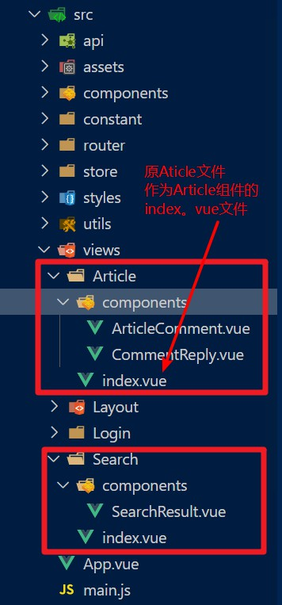
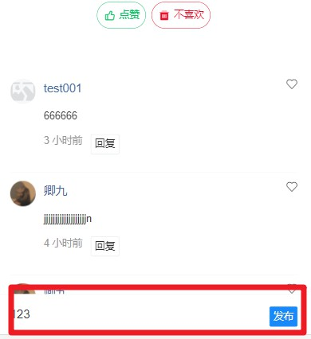
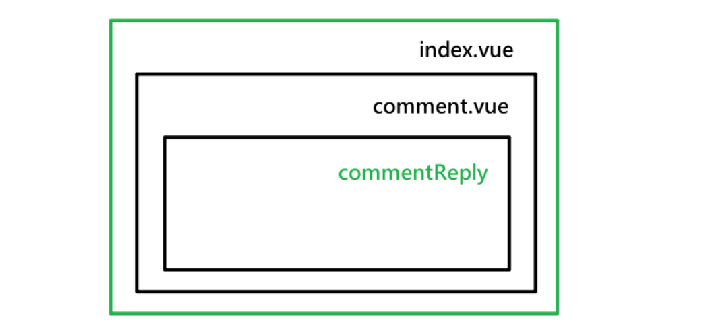
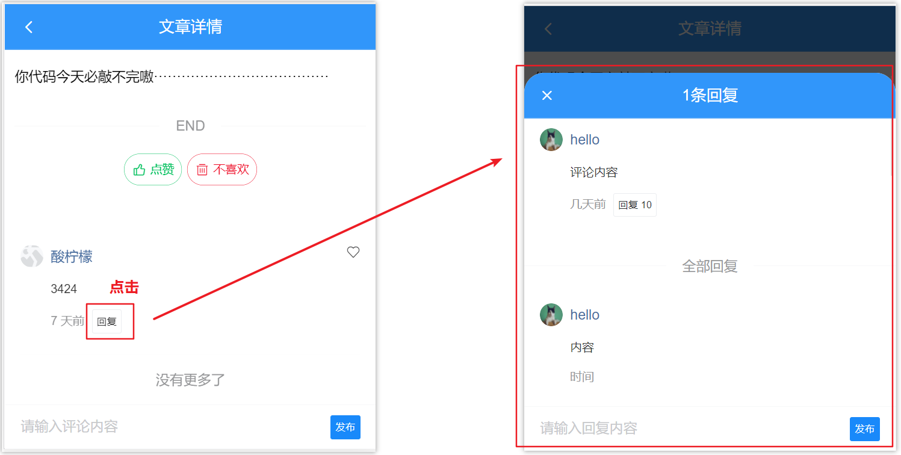
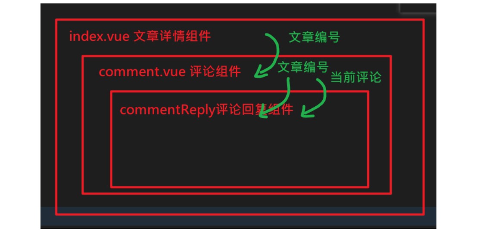
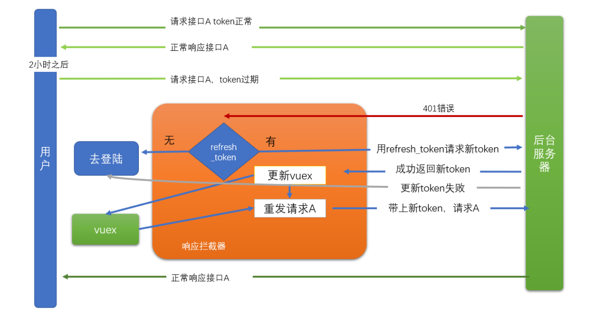
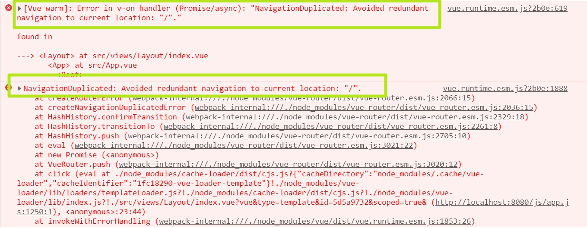

# day85

### src文件结构调整，抽离文章评论模块



- 路由文件路径，引入文件路径调整

### 发布评论 



- 封装接口`api/comment.js`

  ```js
  /**
   * 对文章进行评论
   * @param {*} articleId 文章编号
   * @param {*} content 评论内容
   */
  export const reqAddComment = (articleId, content) => {
    return http({
      method: 'post',
      url: '/v1_0/comments',
      data: {
        target: articleId,
        content
      }
    })
  }
  ```

- 根据接口文档，父组件 传递文章**ID**`src/views/Article/index.vue`

  ```jsx
  <!-- 文章评论 -->
  <article-comment :articleId="id"></article-comment>
  <!-- /文章评论 -->
  ```

- 子组件接收参数，准备评论内容`src/views/Article/components/ArticleComment.vue`

  ```jsx
  <!-- 发布评论 -->
  <van-cell-group class="publish-wrap">
    <van-field clearable placeholder="请输入评论内容" v-model.trim="content">
      <van-button slot="button" size="mini" type="info" @click="addComment"
        >发布
      </van-button>
    </van-field>
  </van-cell-group>
  <!-- /发布评论 -->
  
  props: {
    articleId: {
      type: String,
      require: true
    }
  },
      
  data() {
    return {
      content: ''
    }
  },
  ```

- 完善逻辑代码`methods`

  ```js
  async addComment() {
    try {
      if (this.content === '') return
      const {
        data: {
          data: { new_obj: comment }
        }
      } = await reqAddComment(this.articleId, this.content)
      this.list.unshift(comment)
    } catch (error) {
      this.$toast.fail('该文章已关闭评论')
    }
    this.content = ''
  },
  ```

### 评论点赞 

- 接口封装`src/api/comment.js`

  ```js
  /**
   * 对文章评论进行点赞
   * @param {*} commentId 评论id
   */
  export const reqAddCommentLike = commentId => {
    return http({
      method: 'post',
      url: '/v1_0/comment/likings',
      data: {
        target: commentId
      }
    })
  }
  
  /**
   * 取消文章评论的点赞
   * @param {*} commentId 评论id
   */
  export const reqDeleteCommentLike = commentId => {
    return http({
      method: 'delete',
      url: '/v1_0/comment/likings/' + commentId
    })
  }
  ```

- 视图控制

  ```jsx
  <van-icon
    @click="toggleCommentLike(item)"
    slot="right-icon"
    :name="item.is_liking ? 'like' : 'like-o'"
  />
  ```

- 逻辑代码

  ```js
  import { ..., reqAddCommentLike, reqDeleteCommentLike } from '@/api/comment.js'
  
  // 切换评论的点赞状态
  async toggleCommentLike(comment) {
    try {
      const commentId = comment.com_id.toString()
      if (comment.is_liking) {
        // 点赞状态, 点击按钮时, 应该要取消点赞
        await reqDeleteCommentLike(commentId)
        this.$toast.success('取消喜欢成功')
      } else {
        // 非点赞状态, 点击按钮时, 应该要点赞
        await reqAddCommentLike(commentId)
        this.$toast.success('喜欢成功')
      }
      // 数据回显
      comment.is_liking = !comment.is_liking
    } catch (e) {
      console.log(e)
      this.$toast.fail('操作失败')
    }
  },
  ```

### 评论回复

> 通过vant中的弹层[**popup组件**](https://youzan.github.io/vant/#/zh-CN/popup#yuan-jiao-dan-chuang)形式显示回复内容

- 新建组件`src/views/Article/components/CommentReply.vue`（结构模版）

  ```jsx
  <template>
  <div class="article-comments">
      <!-- 导航栏 -->
      <van-nav-bar title="1条回复">
        <van-icon slot="left" name="cross" />
      </van-nav-bar>
      <!-- /导航栏 -->
  
      <!-- 当前评论 -->
      <van-cell title="当前评论">
        <van-image
          slot="icon"
          round
          width="30"
          height="30"
          style="margin-right: 10px;"
          src="https://img.yzcdn.cn/vant/cat.jpeg"
        />
        <span style="color: #466b9d;" slot="title">hello</span>
        <div slot="label">
          <p style="color: #363636;">评论内容</p>
          <p>
            <span style="margin-right: 10px;">几天前</span>
            <van-button
              size="mini"
              type="default"
            >回复 10</van-button>
          </p>
        </div>
        <van-icon slot="right-icon" />
      </van-cell>
      <!-- /当前评论 -->
      <van-divider>全部回复</van-divider>
  
      <!-- 对当前评论 回复列表 -->
      <van-list
        v-model="loading"
        :finished="finished"
        finished-text="没有更多了"
        @load="onLoad"
       >
        <van-cell
          v-for="(item, index) in list"
          :key="index"
        >
          <van-image
            slot="icon"
            round
            width="30"
            height="30"
            style="margin-right: 10px;"
            src="https://img.yzcdn.cn/vant/cat.jpeg"
          />
          <span style="color: #466b9d;" slot="title">hello</span>
          <div slot="label">
            <p style="color: #363636;">内容</p>
            <p>
              <span style="margin-right: 10px;">时间</span>
            </p>
          </div>
        </van-cell>
      </van-list>
      <!-- 回复列表 -->
  
      <!-- 发布回复 -->
      <van-cell-group class="publish-wrap">
        <van-field
          clearable
          placeholder="请输入回复内容"
        >
          <van-button
            slot="button"
            size="mini"
            type="info"
          >发布</van-button>
        </van-field>
      </van-cell-group>
      <!-- /发布回复 -->
  </div>
  
  </template>
  <script>
  export default {
    name: 'CommentReply',
    data () {
      return {
        list: [], // 评论列表
        loading: false, // 上拉加载更多的 loading
        finished: false // 是否加载结束
      }
    },
    methods: {
      onLoad () {
        // 异步更新数据
        setTimeout(() => {
          for (let i = 0; i < 10; i++) {
            this.list.push(this.list.length + 1)
          }
          // 加载状态结束
          this.loading = false
  
          // 数据全部加载完成
          if (this.list.length >= 40) {
            this.finished = true
          }
        }, 500)
      }
    }
  }
  </script>
  <style lang="scss" scoped>
  // 发表评论的区域是固定在下端的
  .publish-wrap {
    position: fixed;
    left: 0;
    bottom: 0;
    width: 100%;
  }
  // 给发表评论区空出地方
  .van-list {
    margin-bottom: 45px;
  }
  </style>
  ```

#### 组件使用



- `src/views/Article/components/ArticleComment.vue`使用`van-group`

  > 对于**commentReply**组件，由于请求回复列表的动作只在第一次创建这个组件时执行，所以导致第二次点击某个评论的回复时，还是显示第一次点击回复时取回来的回复列表
  >
  > 补充一个v-if来控制动态创建组件：`v-if="isShowReply"`

  ```jsx
  <!-- 回复组件 -->
  <van-popup
    v-model="isShowReply"
    round
    position="bottom"
    :style="{ height: '85%' }"
  >
    <comment-reply
      v-if="isShowReply"
      @close="isShowReply = false"
    ></comment-reply>
  </van-popup>
  <!-- /回复组件 -->
  ```

- 设置显示状态

  ```js
  isShowReply: false
  ```

- 设置事件，处理函数

  ```js
  clickShowReply () {
    this.isShowReply = true
  }
  ```



#### 展示当前评论

- `src/views/Article/components/ArticleComment.vue`点击回复，传入当前评论，弹出弹框

  ```jsx
  <van-button
    @click="clickShowReply(item)"
    size="mini"
    type="default"
  >
    回复
  </van-button>
  /* methods */
  clickShowReply (currentComment) {
    // 1. 展示回复组件
    this.isShowReply = true
    // 2. 更新正在回复的组件
    this.currentComment = currentComment
  }
  ```

- 传递给子组件

  ```jsx
  <comment-reply
    v-if="isShowReply"
    @close="isShowReply = false"
    :currentComment="currentComment"
  ></comment-reply>
  ```

- `src/views/Article/components/CommentReply.vue`接收参数更新视图

  ```jsx
  <!-- 导航栏 -->
  <van-nav-bar :title="currentComment.reply_count + '条回复'">
    <van-icon @click="$emit('close')" slot="left" name="cross" />
  </van-nav-bar>
  <!-- /导航栏 -->
  
  <!-- 当前评论 -->
  <van-cell title="当前评论">
    <van-image
      slot="icon"
      round
      width="30"
      height="30"
      style="margin-right: 10px;"
      :src="currentComment.aut_photo"
    />
    <span style="color: #466b9d;" slot="title">{{
      currentComment.aut_name
    }}</span>
    <div slot="label">
      <p style="color: #363636;">{{ currentComment.content }}</p>
      <p>
        <span style="margin-right: 10px;">{{
          currentComment.pubdate | relative
        }}</span>
        <van-button size="mini" type="default"
          >回复 {{ currentComment.reply_count }}</van-button
        >
      </p>
    </div>
    <van-icon slot="right-icon" />
  </van-cell>
  <!-- /当前评论 -->
  
  props: {
    currentComment: {
      type: Object,
      require: true
    }
  },
  ```

#### 展示评论回复列表

- 封装接口`src/api/comment.js`

  ```js
  /**
   * 获取文章评论回复
   * @param {*} commentId 回复的评论id
   * @param {*} offset 获取评论数据的偏移量，值为评论id，表示从此id的数据向后取，不传表示从第一页开始读取数据
   */
  export const reqGetCommentsReplys = (commentId, offset) => {
    return http({
      method: 'get',
      url: '/v1_0/comments',
      params: {
        type: 'c', // a表示对文章的评论 ,c表示对评论的回复
        source: commentId,
        offset
      }
    })
  }
  ```

- 调用接口，封装方法

  ```js
  import { reqGetCommentsReply } from '@/api/comment'
  async onLoad() {
    try {
      // 请求获取数据
      const res = await reqGetCommentsReply(
        this.currentComment.com_id.toString(),
        this.offset
      )
      const arr = res.data.data.results
      // 将数据追加到list前面
      this.list = [...this.list, ...arr]
      // 加载状态结束
      this.loading = false
      // 更新offset
      this.offset = res.data.data.last_id
      // 判断数据是否加载完成
      if (arr.length === 0) {
        this.finished = true
      }
    } catch (e) {
      console.log(e)
    }
  },
  ```

- 结构调整

  ```jsx
  <!-- 对当前评论 回复列表 -->
  <van-list
    v-model="loading"
    :finished="finished"
    finished-text="没有更多了"
    @load="onLoad"
  >
    <van-cell v-for="(item, index) in list" :key="index">
      <van-image
        slot="icon"
        round
        width="30"
        height="30"
        style="margin-right: 10px;"
        :src="item.aut_photo"
      />
      <span style="color: #466b9d;" slot="title">{{ item.aut_name }}</span>
      <div slot="label">
        <p style="color: #363636;">{{ item.content }}</p>
        <p>
          <span style="margin-right: 10px;">{{
            item.pubdate | relative
          }}</span>
        </p>
      </div>
    </van-cell>
  </van-list>
  <!-- 回复列表 -->
  ```

### 发布评论回复

- 封装接口`src/api/comment.js`

  ```js
  /**
   * 添加文章评论回复
   * @param {*} commentId 评论id
   * @param {*} content 内容
   * @param {*} articleId 文章id
   */
  export const reqAddCommentReply = (commentId, content, articleId) => {
    return http({
      method: 'post',
      url: '/v1_0/comments',
      data: {
        target: commentId,
        content,
        art_id: articleId
      }
    })
  }
  ```

- 参数分析

  

- 父组件传递文章编号`src/views/Article/index.vue`

  ```jsx
  <comment-reply
    v-if="isShowReply"
    @close="isShowReply = false"
    :article-id="articleId"
    :currentComment="currentComment"
  ></comment-reply>
  ```

- 接收参数`src/views/Article/components/CommentReply.vue`

  ```jsx
  props: {
    currentComment: {
      type: Object,
      require: true
    },
    articleId: {
      type: String,
      required: true
    }
  },
  ```

- 事件绑定

  ```jsx
  <!-- 发布回复 -->
  <van-cell-group class="publish-wrap">
    <van-field clearable placeholder="请输入回复内容" v-model.trim="content">
      <van-button slot="button" size="mini" type="info" @click="addApply"
        >发布回复</van-button
      >
    </van-field>
  </van-cell-group>
  <!-- /发布回复 -->
  
  data () {
    return {
      content: '' // 回复的内容
    }
  }
  ```

- 逻辑代码

  ```js
  import { ..., reqAddCommentReply } from '@/api/comment'
  async addApply() {
    if (this.content === '') return
    // 1 发送请求, 添加评论
    const res = await reqAddCommentReply(
      this.currentComment.com_id.toString(),
      this.content,
      this.articleId
    )
    // 2 更新视图, 添加评论成功, 最新的评论应该在最上面
    this.list.unshift(res.data.data.new_obj)
    // 3 回复的数量 +1
    this.currentComment.reply_count++
    // 4 清空评论区
    this.content = ''
    // 5. 给出操作提示
    this.$toast.success('发布回复成功')
  }
  ```

### 在评论回复组件关闭弹层

- 通过发送事件影响父组件关闭弹窗`src/views/Article/components/CommentReply.vue`

  ```jsx
  在父组件中, 注册事件, 监听处理<!-- 导航栏 -->
  <van-nav-bar :title="currentComment.reply_count + '条回复'">
    <van-icon @click="$emit('close')" slot="left" name="cross" />
  </van-nav-bar>
  <!-- /导航栏 -->
  ```

- 在父组件中, 注册事件, 监听处理

  ```jsx
  <comment-reply
    v-if="isShowReply"
    @close="isShowReply = false"
    :article-id="articleId"
    :currentComment="currentComment"
  ></comment-reply>
  ```

##权限处理 -- (全局前置守卫 - 登录拦截)

- `src/router/index.js`

  ```js
  import store from '@/store'
  
  // 需要认证的页面
  const AuthLinks = ['/user']
  router.beforeEach((to, from, next) => {
    console.log('to==>', to)
    // 如果是需要授权的页面
    if (AuthLinks.includes(to.path)) {
      // 进行验证身份
      if (store.state.user.tokenInfo.token) {
        next()
      } else {
        // 拦截到登录
        next({
          path: '/login',
          query: {
            backTo: to.fullPath
          }
        })
      }
    } else {
      next()
    }
  })
  ```

- `src/views/Login/index.vue`

  ```js
  async login() {
    ...
    try {
      ...
      // 在登录守卫时保存的网页会在登录之后返回，否则进入'/'页面
      const backto = this.$route.query.backTo || '/'
      this.$router.push(backto)
    } catch (error) {
     ...
    }
  },
  ```

## token 过期处理



- [响应拦截器](https://www.kancloud.cn/yunye/axios/234845)处理token`src/utils/http.js`

  ```js
  http.interceptors.response.use(
    response => {
      return response
    },
    error => {
      console.dir(error)
      if (error.response.status === 401) {
        const refreshToken = store.state.user.tokenInfo.refresh_token
        if (refreshToken) {
          console.log('刷新')
        } else {
          // 没有refreshToken, 直接去登录, 将来还能跳回来
          // router.currentRoute 指向当前路由信息对象 === 等价于之前页面中用的 this.$route
          // 清除本地token, 跳转登录 (无意义的本地token内容, 要清除)
          store.commit('user/removeTokenInfo')
          router.push({
            path: '/login',
            query: {
              backTo: router.currentRoute.fullPath
            }
          })
        }
      }
      return Promise.reject(error)
    }
  )
  ```

- `src/store/modules/user.js`

  ```js
  import { ..., delToken } from '@/utils/storage'
  const state = {
    tokenInfo: getToken()
  }
  const mutations = {
    ...
    removeTokenInfo() {
      state.tokenInfo = {}
      delToken()
    }
  }
  ...
  ```

### Tip -- 项目路由重复跳转问题



```js
// 类似这种报错说明是路由地址的重复跳转
// 解决办法为在路由模块下增加如下代码
// 重新改写路由对象原型上的push方法
// 上述虽然是爆红但是不影响功能
const originalPush = VueRouter.prototype.push
VueRouter.prototype.push = function push(location) {
  return originalPush.call(this, location).catch(err => err)
}
```

