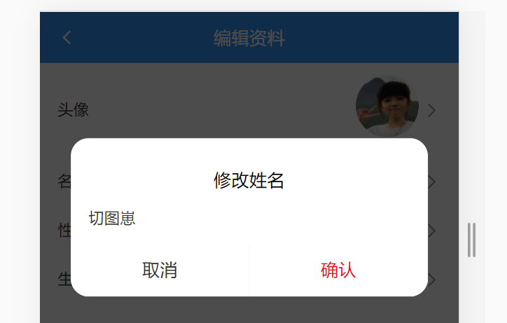
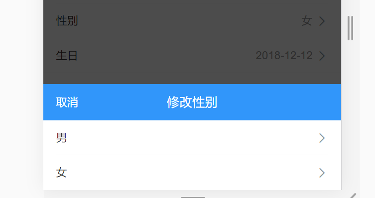
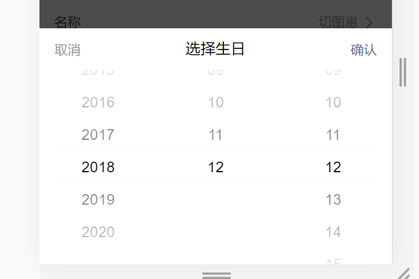

# day86

### refresh_token 用于刷新token`src/utils/http.js`

```js
http.interceptors.response.use(
  response => {
    return response
  },
  async error => {
    if (error.response.status === 401) {
      // 在token失效时先调取vuex保存的refresh_token
      const refreshToken = store.state.user.tokenInfo.refresh_token
      if (refreshToken) {
        try {
          const {
            data: {
              data: { token }
            }
          } = await reqPutNewToken(refreshToken)
          // 通过refresh_token请求新的token
          const newToken = token
          // 将新token保存在vuex中
          store.commit('user/setTokenInfo', {
            token: newToken,
            refresh_token: refreshToken
          })
          // 在error.config中获取请求数据更改请求头字段重新发送请求
          error.config.headers.Authorization = `Bearer ${newToken}`
          return http(error.config)
        } catch (error) {
          store.commit('user/removeTokenInfo')
          router.push({
            path: '/login',
            query: {
              backTo: router.currentRoute.fullPath
            }
          })
        }
      } else {
        ...
    }
    return Promise.reject(error)
  }
)
```

- `reqPutNewToken`API封装`src/api/user.js`

  ```js
  /**
   * 刷新用户token
   */
  export const reqPutNewToken = refreshToken => {
    return http({
      method: 'put',
      url: '/v1_0/authorizations',
      headers: {
        Authorization: `Bearer ${refreshToken}`
      }
    })
  }
  ```

- 修改请求拦截`src/utils/http.js`

  ```js
  http.interceptors.request.use(
    config => {
      const token = store.state.user.tokenInfo.token
      // 请求发送时会自动进入拦截器，为避免无效字段覆盖有效字段，进行处理
      if (token && !config.headers.Authorization) {
        config.headers.Authorization = `Bearer ${token}`
      }
      return config
    },
    error => {
      return Promise.reject(error)
    }
  )
  ```

#### 存在问题（小bug）

- 场景
  - 在没有登录的情况下，查看某个文章详情页
  - 详情页中点击**关注**，会出401错误，被拦截器处理，回到登录页
  - 在登陆页正常登陆，成功之后，会再次进入详情页。
- 问题
  - 如果此时，点击详情页中后页按钮
  - 回到： 登陆页
  - 再次从登陆页，登陆时，又回到详情页。如此反复，无法回到主页

- 解决方案
  - 全局前置守卫里面加个判断
  - 如果是去`'/login'`, 判断 `token` 是否存在
  - 如果存在说明登录过了, 直接跳转到首页 

- `src/router/index.js`

  ```js
  router.beforeEach((to, from, next) => {
    const token = store.state.user.tokenInfo.token
    if (to.path === '/login' && token) {
      next('/')
      return
    }
    ...
  })
  ```

## 个人中心`src/views/Layout/User/index.vue`

- 基础结构样式

  ```jsx
  <template>
    <div class="user">
      <!-- 用户个人资料 -->
      <div class="user-profile">
        <div class="info">
          <van-image round src="https://img.yzcdn.cn/vant/cat.jpeg" />
          <h3 class="name">
            用户名
            <br />
            <van-tag size="mini">申请认证</van-tag>
          </h3>
        </div>
        <van-row>
          <van-col span="8">
            <p>0</p>
            <p>动态</p>
          </van-col>
          <van-col span="8">
            <p>0</p>
            <p>关注</p>
          </van-col>
          <van-col span="8">
            <p>0</p>
            <p>粉丝</p>
          </van-col>
        </van-row>
      </div>
      <!-- /用户个人资料 -->
        
      <!-- 操作链接 -->
      <van-row class="user-links">
        <van-col span="8">
          <van-icon name="newspaper-o" color="#7af" />我的作品
        </van-col>
        <van-col span="8">
          <van-icon name="star-o" color="#f00" />我的收藏
        </van-col>
        <van-col span="8">
          <van-icon name="tosend" color="#fa0" />阅读历史
        </van-col>
      </van-row>
      <!-- /操作链接 -->
        
      <!-- 编辑入口 -->
      <van-cell-group class="user-group">
        <van-cell icon="edit" title="编辑资料" to="/userProfile" is-link />
        <van-cell icon="chat-o" title="小智同学" to="/userChat" is-link />
        <van-cell icon="setting-o" title="系统设置" is-link />
        <van-cell icon="warning-o" title="退出登录" is-link />
      </van-cell-group>
      <!-- /编辑入口 -->
    </div>
  </template>
  
  <script>
  export default {
    name: 'UserIndex',
    data () {
      return {
  
      }
    }
  }
  </script>
  
  <style lang="scss" scoped>
  .user {
    margin-top: -46px;
    padding-bottom: 50px;
    .user-profile {
      width: 100%;
      height: 200px;
      display: block;
      background: #3296fa;
      color: #fff;
      .info {
        display: flex;
        padding: 20px;
        align-items: center;
        .van-image{
          width: 64px;
          height: 64px;
        }
        .name {
          font-size: 16px;
          font-weight: normal;
          margin-left: 10px;
        }
        .van-tag {
          background: #fff;
          color: #3296fa;
        }
      }
      p{
        margin: 0;
        text-align: center;
      }
    }
    .user-group {
      margin-bottom: 15px;
    }
    .user-links {
      padding: 15px 0;
      font-size: 12px;
      text-align: center;
      background-color: #fff;
      .van-icon {
        display: block;
        font-size: 24px;
        padding-bottom: 5px;
      }
    }
  }
  </style>
  ```

- 引入vant组件

  ```js
  import {
    Tag,
    Row,
    Col
  } from 'vant'
  
  Vue.use(Tag)
  Vue.use(Row)
  Vue.use(Col)
  ```

- 修改`src/views/Layout/index.vue`**nav-bar**的显示 ： 如果不在`/user`页面中， 才显示搜索导航区域。

  ```jsx
  <van-nav-bar fixed v-if="$route.path !== '/user'">
  ```

### 数据渲染

- 封装方法`src/api/user.js ` 

  ```js
  /**
   * 获取用户个人信息 (用于个人中心页的渲染数据)
   */
  export const reqGetUserInfo = () => {
    return http({
      method: 'get',
      url: '/v1_0/user'
    })
  }
  ```

- 调用接口完成逻辑代码

  ```js
  import { reqGetUserInfo } from '@/api/user'
  
  data () {
    return {
      user: {}
    }
  },
  created () {
    this.loadInfo()
  },
  methods: {
    async loadInfo () {
      const res = await reqGetUserInfo()
      this.user = res.data.data
    }
  }
  ```

- 修改结构

  ```jsx
  <!-- 用户个人资料 -->
  <div class="user-profile">
    <div class="info">
      <van-image round :src="user.photo" />
      <h3 class="name">
        {{ user.name }}
        <br />
        <van-tag size="mini">申请认证</van-tag>
      </h3>
    </div>
    <van-row>
      <van-col span="8">
        <p>{{ user.art_count }}</p>
        <p>动态</p>
      </van-col>
      <van-col span="8">
        <p>{{ user.follow_count }}</p>
        <p>关注</p>
      </van-col>
      <van-col span="8">
        <p>{{ user.fans_count }}</p>
        <p>粉丝</p>
      </van-col>
    </van-row>
  </div>
  <!-- /用户个人资料 -->
  ```

### 退出功能

- 注册事件

  ```jsx
  <van-cell @click="logout" icon="warning-o" title="退出登录" is-link />
  ```

- 使用**vant**组件显示弹出提示框

  ```js
  import { Dialog } from 'vant'
  Vue.use(Dialog)
  ```

- 退出时清除token

  ```js
  import { mapMutations } from 'vuex'
  
  methods: {
    ...mapMutations('user', ['removeTokenInfo']),
    
    logout() {
      // 通过方法调用
      this.$dialog
        .confirm({
          title: '温馨提示',
          message: '你确认要退出么?'
        })
        .then(() => {
          // 清除本地token对象信息
          this.removeTokenInfo()
          // 跳转登录页
          this.$router.push('/login')
        })
        .catch(() => {
          // on cancel
          // 就算你对取消操作不做任何处理，也需要保留catch。
          // 如果删除了catch，则点击确认对话框中的取消时，会抛出promise的错误
        })
    }
  }
  ```

### 编辑资料

- 新建组件`src/views/Layout/User/components/UserProfile.vue`（样式模版）

  ```jsx
  <template>
    <div class="profile">
      <!-- 导航条 -->
      <van-nav-bar left-arrow @click-left="$router.back()" title="编辑资料"></van-nav-bar>
  
      <!-- 编辑区 -->
      <van-cell-group>
        <van-cell is-link title="头像"  center>
          <van-image
            slot="default"
            width="1.5rem"
            height="1.5rem"
            fit="cover"
            round
          />
        </van-cell>
  
        <van-cell is-link title="名称" value="张老三" @click="showName=true"/>
        <van-cell is-link title="性别" value="男" @click="showGender=true"/>
        <van-cell is-link title="生日" value="" @click="showBirthday=true"/>
      </van-cell-group>
    </div>
  </template>
  
  <script>
  export default {
    name: 'userProfile',
    data () {
      return {
        // 控制弹层
        showName: false,
        showGender: false,
        showBirthday: false,
        // 当前用户的信息
        user: {}
      }
    }
  }
  </script>
  
  <style lang="scss">
  .profile {
    ::v-deep {
      .van-nav-bar__text {
        color: #fff;
      }
    }
  }
  </style>
  ```

- 配置路由(一级路由)

  ```js
  import UserProfile from '@/views/Layout/User/components/UserProfile'
  
  
  { path: '/userProfile', component: UserProfile },
  ```

#### 个人信息渲染

- 调用 `src/api/user.js` 接口（已写过）

  ```js
  /**
   * 获取用户个人信息(编辑页)
   */
  export const reqGetProfile = () => {
    return http({
      method: 'get',
      url: '/v1_0/user/profile'
    })
  }
  ```

- 调用接口

  ```js
  import { reqGetProfile } from '@/api/user.js'
  
  data() {
    return {
      user: {}
    }
  },
  
  created () {
    this.loadProfile()
  },
  methods: {
    async loadProfile () {
      const res = await reqGetProfile()
      this.user = res.data.data
    }
  }
  ```

- 调整结构

  ```jsx
  <van-cell-group>
    <van-cell is-link title="头像"  center>
      <van-image
        slot="default"
        width="1.5rem"
        height="1.5rem"
        fit="cover"
        round
        :src="user.photo"
      />
    </van-cell>
  
    <!-- 名字 -->
    <van-cell is-link title="名称" :value="user.name" @click="showName=true"/>
    <!-- 性别 -->
    <!-- 接口返回信息 -- 0是男, 1是女 -->
    <van-cell is-link title="性别" :value="user.gender === 0 ? '男' : '女'" @click="showGender=true"/>
    <!-- 生日 -->
    <van-cell is-link title="生日" :value="user.birthday" @click="showBirthday=true"/>
  </van-cell-group>
  ```

#### 编辑姓名



- 封装接口`src/api/user.js`

  ```js
  /**
   * 修改用户个人信息
   * obj {
   *   name: 昵称,
   *   birthday: 生日
   *   gender: 性别
   * }
   */
  export const reqUpdateUserInfo = (obj) => {
    return http({
      method: 'patch',
      url: '/v1_0/user/profile',
      data: obj
    })
  }
  ```

- 准备弹出框

  ```jsx
  <!-- 修改名字 -->
  <van-dialog
    @confirm="saveName"
    v-model="showName"
    title="修改姓名"
    show-cancel-button
  >
    <van-field v-model.trim="newName" placeholder="请输入姓名"></van-field>
  </van-dialog>
  <!-- /修改名字 -->
  ```

- 点击时, 显示弹框, 回显数据

  ```js
  data() {
    return {
      // 控制弹层
      showName: false,
      // 当前用户的信息
      user: {},
      newName: '',
    }
  },
       
  clickShowName() {
    this.showName = true
    this.newName = this.user.name
  },
  ```

- `confirm`事件,  确认时, 调用接口, 发送请求

  ```js
  import { ..., reqUpdateUserInfo } from '@/api/user'
  
  async saveName() {
    try {
      // 保存名字
      if (this.newName === '') return
      if (this.newName.length > 7) {
        this.$toast.fail('名字长度不能超过 7 个字符')
        return
      }
      // 发送请求, 修改姓名
      await reqUpdateUserInfo({
        name: this.newName
      })
      // 更新视图
      this.user.name = this.newName
      this.newName = ''
      this.$toast.success('修改成功')
    } catch {
      this.$toast.fail('修改失败')
    }
  },
  ```

#### 编辑性别



- 准备弹出框及相关数据

  ```jsx
  <!-- 修改性别 -->
  <van-popup v-model="showGender" position="bottom">
    <van-nav-bar
      title="修改性别"
      left-text="取消"
      @click-left="showGender = false"
    >
    </van-nav-bar>
    <van-cell title="男" @click="saveGender(0)" is-link></van-cell>
    <van-cell title="女" @click="saveGender(1)" is-link></van-cell>
  </van-popup>
  <!-- /修改性别 -->
  
  data() {
    return {
      // 控制弹层
      showName: false,
      showGender: false,
      // 当前用户的信息
      user: {},
      newName: ''
    }
  },
  ```

- 点击时, 发送修改的请求

  ```js
  async saveGender(gender) {
    // console.log(gender)
    try {
      await reqUpdateUserInfo({
        gender
      })
      this.user.gender = gender
      this.$toast.success('修改成功')
      this.showGender = false
    } catch {
      this.$toast.success('修改失败')
    }
  },
  ```

#### 编辑生日



- 挂载vant组件[**DatetimePicker**](https://vant-contrib.gitee.io/vant/#/zh-CN/datetime-picker)

  ```js
  import { DatetimePicker } from 'vant'
  Vue.use(DatetimePicker)
  ```

- 准备弹出层及相关数据

  ```jsx
  <!-- 修改生日 -->
  <van-popup v-model="showBirthday" position="bottom">
    <van-datetime-picker
      @cancel="showBirthday = false"
      @confirm="saveBirthday"
      v-model="newDate"
      type="date"
      title="选择生日"
      :min-date="minDate"
      :max-date="maxDate"
    />
  </van-popup>
  <!-- /修改生日 -->
  
  data() {
    return {
      // 控制弹层
      showName: false,
      showGender: false,
      showBirthday: false,
      // 当前用户的信息
      user: {},
      newName: '',
      minDate: new Date(1900, 0, 1), // 最小时间
      maxDate: new Date(), // 最大时间
      newDate: new Date() // 修改后的新生日
    }
  },
  ```

- 显示弹层, 要做日期的回显

  ```jsx
  <!-- 生日 -->
  <van-cell
    is-link
    title="生日"
    :value="user.birthday"
    @click="clickShowBirthday"
  />
  
  clickShowBirthday() {
    this.showBirthday = true
    this.newDate = new Date(this.user.birthday)
  },
  ```

- 根据接口文档，日期格式: 后台需要 'xxxx-xx-xx' 的格式，通过 dayjs 处理

  ```js
  import dayjs from 'dayjs'
  
  async saveBirthday() {
    try {
      const birthday = dayjs(this.newDate).format('YYYY-MM-DD')
      await reqUpdateUserInfo({
        birthday
      })
      // 更新视图
      this.user.birthday = birthday
      this.$toast.success('修改成功')
      this.showBirthday = false
    } catch {
      this.$toast.fail('修改失败')
      this.showBirthday = false
    }
  },
  ```

#### 头像编辑

> 通过隐藏域按钮实现文件上传
>
> 选择文件时, 发送请求,  注意接口的格式是formData

- 封装接口`src/api/user.js`

  ```js
  /**
   * 修改用户头像
   * @param {*} formData 收集文件对象的formData
   */
  export const reqUpdatePhoto = (formData) => {
    return http({
      method: 'patch',
      url: '/v1_0/user/photo',
      data: formData
    })
  }
  ```

- 组织结构

  ```jsx
  <!-- 更改头像 -->
  <!-- hidden 是表单元素的一个固有属性, 可以隐藏, 效果类似于 display: none;  -->
  <input @change="changePhoto" type="file" ref="refPhoto" hidden />
  <!-- $refs.refPhoto.click() 通过点击，实际调用file的input按钮 -->
  <van-cell @click="$refs.refPhoto.click()" is-link title="头像" center>
    <van-image
      slot="default"
      width="1.5rem"
      height="1.5rem"
      fit="cover"
      round
      :src="user.photo"
    />
  </van-cell>
  <!-- /更改头像 -->
  ```

- 利用formData收集文件对象信息, 发送文件上传请求

  ```js
  import { ..., reqUpdatePhoto } from '@/api/user'
  
  async changePhoto() {
    try {
      // this.$refs.refPhoto 就是页面上的input文件选择框
      // 它有一个属性files，是一个集合，其中就放置着当前用户选中的文件
      // console.log(this.$refs.refPhoto.files[0])
      const file = this.$refs.refPhoto.files[0]
      // 如果用户直接点击了取消, 就没有选择文件, 不进行上传
      if (!file) return
  
      this.$toast.loading({
        message: '文件上传中...',
        forbidClick: true,
        overlay: true
      })
  
      // 利用formData收集文件对象
      const formData = new FormData()
      formData.append('photo', file)
  
      // 发送请求
      const res = await reqUpdatePhoto(formData)
      // 更新页面
      this.user.photo = res.data.data.photo
      this.$toast.success('更新成功')
    } catch {
      this.$toast.fail('更新失败')
    }
  }
  ```

  

